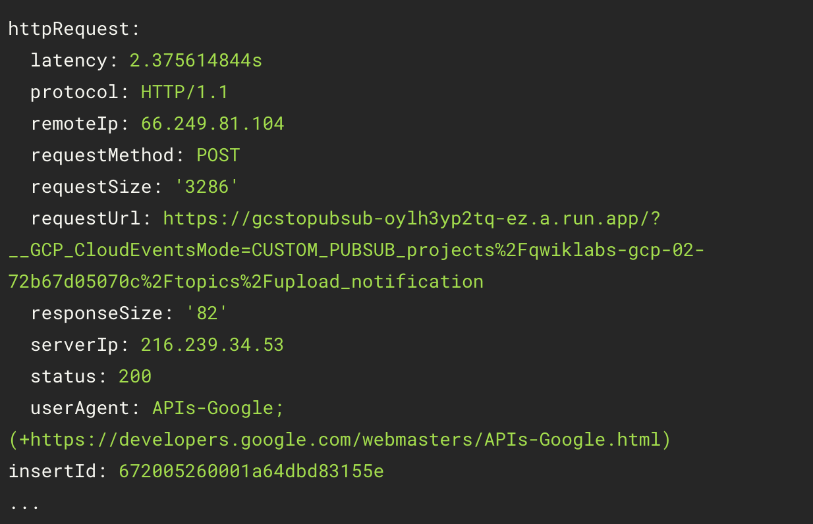
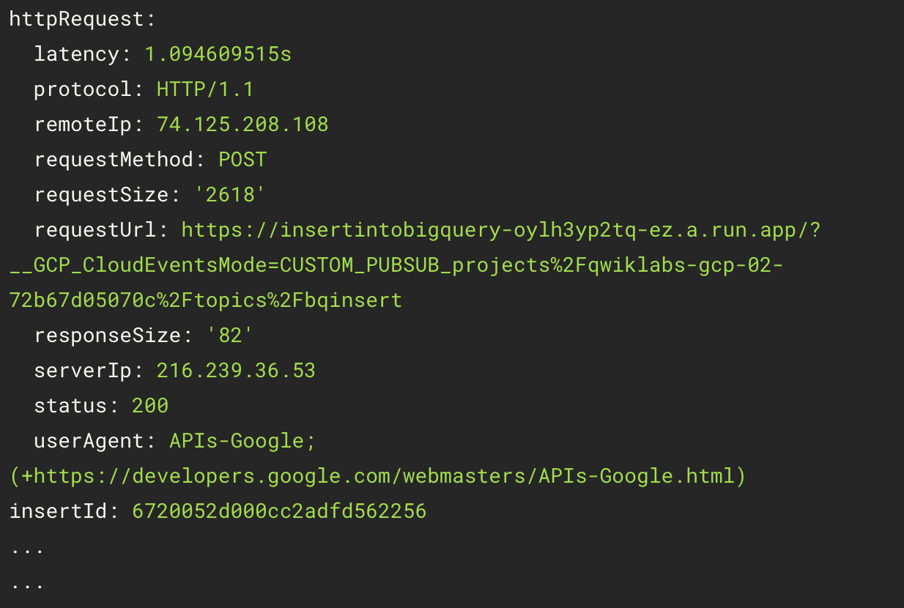

# Intelligent Content Filtering

This project contains scripts to set up a serverless solution for intelligently filtering content uploaded to Cloud Storage.

## Scripts

This directory contains a set of scripts to deploy the solution.

*   `1_buckets.sh`: Creates four Cloud Storage buckets:
    *   `[PROJECT-ID]-upload`: For uploading original content.
    *   `[PROJECT-ID]-filtered`: For storing content that passes the filter.
    *   `[PROJECT-ID]-flagged`: For storing content that is flagged by the filter.
    *   `[PROJECT-ID]-staging`: For staging Cloud Functions deployments.

*   `2_pubsub.sh`: Creates four Pub/Sub topics:
    *   `upload_notification`: For notifications when new content is uploaded.
    *   `visionapiservice`: For sending content to the Vision API.
    *   `videointelligenceservice`: For sending content to the Video Intelligence API.
    *   `bqinsert`: For inserting metadata into BigQuery.

*   `3_gcs_notifications.sh`: Configures Cloud Storage to send a notification to the `upload_notification` Pub/Sub topic when a new object is created in the `[PROJECT-ID]-upload` bucket.

*   `4_cloud_func.sh`: Downloads the Cloud Function code, creates a BigQuery dataset and table.

*   `5_config.sh`: Updates the `config.json` file with the project-specific values for bucket names, dataset ID, and table name.

*   `6_deploy.sh`: Deploys three Cloud Functions:
    *   `GCStoPubsub`: Triggered by a message on the `upload_notification` topic.
    *   `videoIntelligenceAPI`: Triggered by a message on the `videointelligenceservice` topic.
    *   `insertIntoBigQuery`: Triggered by a message on the `bqinsert` topic.

## Deploying the pipeline

Ensure that your `gcloud` configuration points to the project you want to use for this deployment.

You can check with the `gcloud` command.
```
gcloud config list
```
If `project` is not set,  use `gcloud` to set it.
```
gcloud config set project <MY_PROJECT_ID>
```

### Enable APIs
The `gcloud` command can enable the APIs required for this deployment

```
 gcloud services enable \
   bigquery.googleapis.com \
   cloudfunctions.googleapis.com \
   pubsub.googleapis.com \
   storage.googleapis.com \
   videointelligence.googleapis.com
```

### Create the required buckets
The required buckets are created with the shell script.
```
source 1_buckets.sh
```

### Create pub/sub topics
The required pubsub topics are created with the shell script.
```
source 2_pubsub.sh
```

### Create the GCS bucket notifications.
The required GCS bucket notifications are created with the shell script.
```
source 3_gcs_notifications.sh
```
### Download the shared Cloud Function code
The required Cloud Function code is downloaded with the shell script. 
BigQuery tables are created also.
```
source 4_cloud_func.sh
```
### Update the Cloud Function configuration

The make changes to the Cloud Function config
with the shell script.
```
cd cloud-functions-intelligentcontent-nodejs
source ../5_config.sh
```

### Deploy the Cloud Functions
The Cloud Functions are deployed with the shell script.
```
source ../6_deploy.sh
```

### Validate the resources

List the buckets:
```
gcloud storage ls
```
List the Pub/Sub topics
```
gcloud pubsub topics list
```
Verify the BQ table exists:
```
bq --project_id ${PROJECT_ID} show ${DATASET_ID}.${TABLE_NAME}
```
The output should look like:


Verify the Cloud Functions:
```
gcloud beta functions list
```
### Upload a video

Use `gsutil` to upload a video from your local directory to the GCS bucket:
```
gsutil cp my_video.mp4 gs://${IV_BUCKET_NAME}
```
This will automatically kick off the pipeline.

### Validate the pipeline ran
Use `gcloud logging` to view the activity of the Cloud Function:
```
gcloud logging read "resource.type=cloud_run_revision AND resource.labels.service_name=GCStoPubsub AND httpRequest.status=200" --limit 100
```
Expect output like this.



Validate that the data was entered into BigQuery:
```
gcloud logging read "resource.type=cloud_run_revision AND resource.labels.service_name=insertIntoBigQuery AND httpRequest.status=200" --limit 100
```

Expect output like this.


## Query BiqQuery for object classifications
Once a video has been processed the output is available in BiqQuery. The `bq` command can run a query
to find all the labels returned.
```
 bq --project_id ${PROJECT_ID} query < sql_list_labels.txt 
 ```

To find videos with a specific label, update the SQL in this file.
```
bq --project_id ${PROJECT_ID} query < sql_videos_for_label.txt
```

