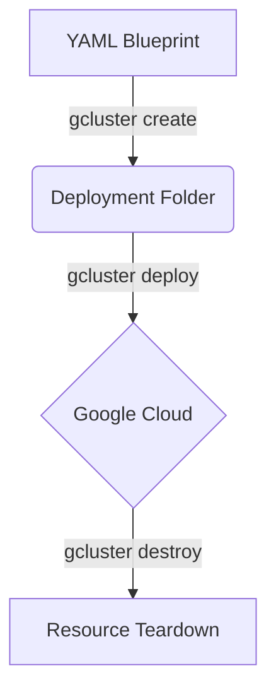

# Cluster Toolkit Overview

The **Google Cloud Cluster Toolkit** (formerly known as the *Cloud HPC Toolkit* or `ghpc`/`gcluster`) is an open-source tool that automates the provisioning of production-ready High-Performance Computing (HPC) and Artificial Intelligence / Machine Learning (AI/ML) workloads on Google Cloud. It wraps around Terraform and Packer to deliver infrastructure aligned with Google Cloud best practices.

## 1. Blueprint Anatomy

A **blueprint** is a high-level configuration file written in YAML. It defines the desired end-state architecture of the cluster by specifying modules, global parameters, and dependency mappings.

A typical blueprint contains three top-level fields:

```yaml
blueprint_name: hpc-slurm-cluster

vars:
  project_id: my-gcp-project-id
  deployment_name: my-slurm-deployment
  region: us-central1
  zone: us-central1-a

deployment_groups:
  - group: primary
    modules:
      # Modules are listed here
```

### Top-Level Fields

- **`blueprint_name`** (String, Required): A short, descriptive identifier for your blueprint.
- **`vars`** (Map, Optional): Global configuration variables. These variables can be referenced in any module using the `$((vars.variable_name))` syntax (e.g., `$((vars.region))`).
- **`deployment_groups`** (List, Required): A list of deployment groups. Each group contains a set of modules that are compiled and deployed together, typically mapping to a single Terraform configuration state.

---

## 2. Module System and Dependencies

Modules are the reusable building blocks of a blueprint. They define specific infrastructure resources such as networks, filestores, compute nodesets, or scheduler configurations.

### Module Schema Structure

Each module entry inside a deployment group contains:
- **`source`** (String, Required): The relative path to the module source within the Cluster Toolkit library (e.g., `modules/network/vpc` or `community/modules/compute/schedmd-slurm-gcp-v6-nodeset`).
- **`id`** (String, Required): A unique identifier for this module instance. This ID is used for dependency reference.
- **`use`** (List, Optional): A list of module IDs that this module depends on.
- **`settings`** (Map, Optional): Module-specific configurations.

### Dependency Mapping (`use` array)

The `use` list defines connections between modules. If Module B is listed in the `use` array of Module A, Module A will automatically inherit/consume output variables exported by Module B.

For example, a compute partition depends on both the VPC network and the Slurm controller node:

```yaml
- source: community/modules/compute/schedmd-slurm-gcp-v6-nodeset
  id: compute-nodeset
  use: [hpc-vpc]               # Automatically inherits network/subnetwork info
  settings:
    machine_type: c2-standard-30

- source: community/modules/compute/schedmd-slurm-gcp-v6-partition
  id: compute-partition
  use: [compute-nodeset]       # Inherits the nodeset specifications
  settings:
    partition_name: compute
```

---

## 3. The Deployment Lifecycle

To provision and manage a cluster defined by a blueprint, use the `gcluster` CLI utility:



### Step 1: Compilation (`create`)
Compiles the YAML blueprint into a clean folder containing auto-generated Terraform configurations, Packer files, and helper scripts:
```bash
./gcluster create path/to/blueprint.yaml --vars "project_id=YOUR_PROJECT_ID"
```

### Step 2: Deployment (`deploy`)
Deploys the compiled Terraform/Packer infrastructure configurations to Google Cloud:
```bash
./gcluster deploy <deployment_folder_name>
```

### Step 3: Teardown (`destroy`)
Safely tears down all cloud resources associated with the deployment:
```bash
./gcluster destroy <deployment_folder_name>
```