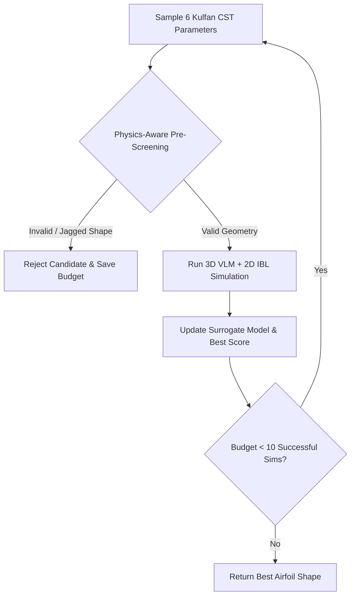

# Airfoil Optimization (3D VLM & Viscous Aerodynamics)

This example evolves a physics-aware search algorithm in Python to optimize the aerodynamic shape of a 2D airfoil. The algorithm optimizes the 6 Kulfan Class Shape Transformation (CST) parameters of the airfoil to maximize the lift-to-drag ratio (`Cl/Cd`) within a budget of exactly 10 actual aerodynamic simulations.

## Why This Architecture Matters for Full CFD & Aerospace Workflows
- **Cheap Compute by Design**: The 3D Finite Wing Vortex Lattice Method (VLM) coupled with a 2D Integral Boundary Layer (IBL) solver is intentionally designed to provide a lightweight, deterministic compute function (~2.1 seconds per simulation). This allows AlphaEvolve to demonstrate evolutionary algorithm discovery without requiring expensive CFD licenses, OpenFOAM installations, or GPU clusters.
- **Direct Transferability to Expensive Full CFD**: In industrial aerodynamics (e.g., Navier-Stokes solvers, OpenFOAM, SU2, ANSYS Fluent), a single 3D simulation can take minutes or hours. The core pattern demonstrated here—using AlphaEvolve to evolve **smart pre-screening heuristics and surrogate models** that reject unphysical or poor candidate geometries *before* spending CPU time—transfers directly and exceptionally well to guarding expensive CFD simulation budgets.

---

## Algorithm Evolution & Pre-Screening Workflow
AlphaEvolve does not just optimize the 6 airfoil parameters directly; it evolves the **search heuristic and pre-filtering logic** inside `main.py` (`# EVOLVE-BLOCK-START` to `# EVOLVE-BLOCK-END`) to maximize efficiency:



---

## Mathematical & Aerodynamic Formulation

### 1. Kulfan Class-Shape Transformation (CST)
The airfoil surface geometry $y(x)$ is parameterized over normalized chord $x \in [0, 1]$ as:

$$y(x) = C(x) \cdot S(x) + x \cdot \Delta z$$

where:
- **Class Function**: $C(x) = x^{0.5} \cdot (1 - x)$ defines a round leading edge and sharp trailing edge.
- **Shape Function**: $S(x) = \sum_{i=0}^{n} w_i \cdot K_i(x)$ is a Bernstein polynomial expansion controlled by the 3 upper and 3 lower Kulfan weights ($w_u, w_l$).

### 2. Aerodynamic Objective Function
The solver evaluates the 3D finite wing lift and drag coefficients and returns:

$$\text{Score} = -\left| \frac{C_l}{C_d} \right|$$

where:
- **$C_l$ (3D Wing Lift)**: Computed via a 1,440-panel swept wing ($AR=10, \Lambda=15^\circ$) Biot-Savart influence matrix with Prandtl-Glauert subsonic compressibility correction.
- **$C_d$ (Total Drag)**: Sum of induced drag ($C_{d,\text{induced}}$), viscous profile drag ($C_{d,\text{profile}}$ via Thwaites-Walz quadrature and Squire-Young wake), stall penalty, and curvature penalty.

---

## Details
- **Optimization Goal**: Evolve a Python optimization algorithm that coordinates CST parameter selection, physics-aware pre-screening, and surrogate models to locate the highest-performance airfoil shape.
- **Programming Language**: Python (with pure NumPy aerodynamic physics solver execution).
- **Modes Supported**: Cloud Batch.
- **Metric Optimized**: `lift_to_drag_ratio` (higher is better, calculated using a 3D Finite Wing Vortex Lattice Method coupled with a Thin Airfoil & Integral Boundary Layer viscous solver).
- **Canonical Search Bounds (`BOUNDS` in `main.py`)**: Standard CST search space bounds (`BOUNDS`) are defined canonically in `main.py` right above `BEST_KNOWN_X`. The optimization loop in `main.py` manages parameter sampling and bounding, while `funct` in `src/optimization/optimization.py` operates as a pure physics solver without any search-bound checks or definitions.

## Aerodynamic Physics Solver Environment (`src/optimization/`)
- **Self-Contained Pure-NumPy Execution**: The evaluations run in a lightweight Python container (`python:3.12-slim-bookworm`) using pure NumPy—free of GPL dependencies or OpenFOAM. Each simulation executes in **~2.1 seconds of CPU runtime**, providing a realistic computational workload where pre-screening and surrogate models save measurable CPU time.
- **How the Solver Works**:
  - **3D Finite Wing Solver (`optimization.py`)**: Extrudes the 2D CST airfoil into a 3D swept wing (aspect ratio 10, sweep 15 deg) discretized into a 1,440-panel Vortex Lattice Method (VLM) grid with spanwise clustering and subsonic compressibility correction. Evaluates 3D wing lift and induced drag (`Cdi`).
  - **2D Viscous & Boundary-Layer Solver (`viscous_solver.py`)**: Computes upper and lower surface velocities by integrating actual geometric thickness and camber slopes along the chord. Because it uses true surface slopes rather than maximum thickness alone, jagged or unphysical candidates generate sharp velocity spikes that trigger turbulent flow separation and heavy drag penalties—preventing optimizer cheating. Integrates laminar and turbulent boundary-layer drag to compute realistic profile drag (`Cd_profile`).
- **Post-Optimization Analysis (Polar Sweep)**: At the end of the experiment, a polar sweep is automatically run across 7 Angles of Attack (0.0 to 15.0 deg in steps of 2.5) for the best airfoil. The sweep generates coefficient plots (`polar_coefficients.png` and `polar_lift_drag.png`) and tabular data (`polar_sweep_results.csv`), uploading them to your GCS experiment bucket.

## Baseline Score & Expected Improvements
- **Baseline Score (`BEST_KNOWN_X` at 5.0 deg AoA baseline)**: **`-7.40`** (`Cl/Cd = 7.40`, since `funct` returns `-1.0 * (Cl / Cd)` for minimization). *(Note: At 0.0 deg AoA, the baseline scores `-10.18`).*
- **Expected Improvement (Evolved Optimization)**: By optimizing the 6 Kulfan CST weights within `BOUNDS`, AlphaEvolve evolves a laminar-flow / pressure-recovery airfoil that delays boundary-layer transition and prevents separation:
  - **Projected Maximum Lift-to-Drag Ratio (`Cl/Cd`)**: **`20 – 30`** (an optimization score of **`-20 to -30`**, roughly tripling the baseline score).

## How to Run
1. Refer to the [Deployment and Execution](../../README.md#deployment-and-execution) section in the root README to deploy the platform.
2. Deploy the experiment configuration using `gcluster` with the preferred variables for this example:   ```bash
   gcluster deploy alpha-evolve-experiment.yaml \
     -d alpha-evolve-deployment.yaml \
     -o ../deployment \
     --vars project_id=[gcp-project-id] \
     --vars existing_bucket_name=[YOUR_BUCKET_NAME] \
     --vars region=[YOUR_REGION] \
     --vars="user_experiment_name=airfoil" \
     --vars example_dir=user_examples/airfoil_optimization \
     --vars max_duration_seconds=7200 \
     --vars concurrency=10 \
     --vars max_duration=24 \
     --vars idle_timeout=5 \
     -w --auto-approve
   ```

- **Experiment Lifetime Configurations**:
  - `max_duration`: The absolute maximum wall-clock time the experiment run can execute from start in hours (valid range: 1 to 24, default: 6).
  - `idle_timeout`: The maximum period of inactivity allowed in hours before the experiment is automatically paused. This must be strictly less than `max_duration` (default: 5).

3. Open the Colab notebook `gs://YOUR_BUCKET/notebook/run_notebook.ipynb` provided by the server deployment to operate the experiment.

