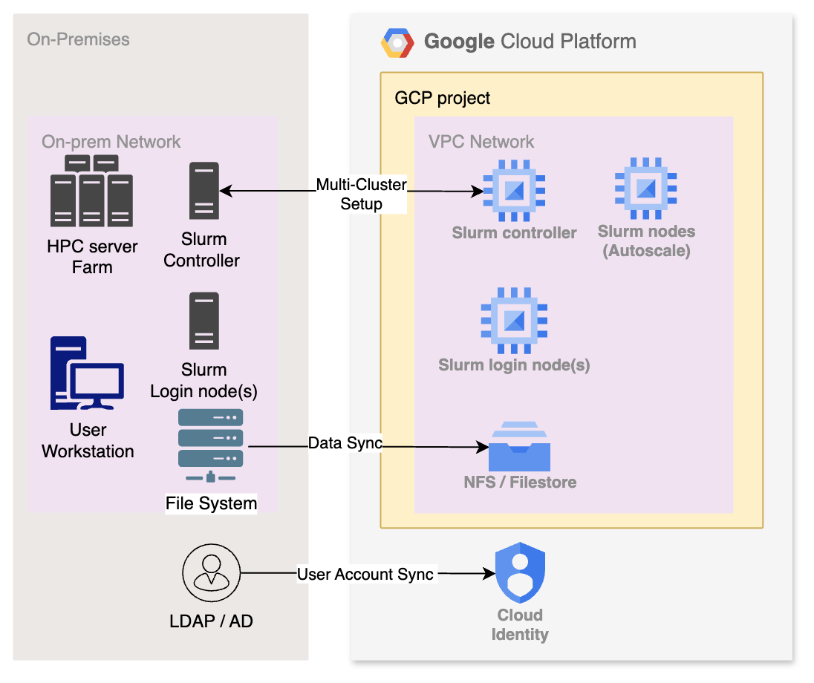

# Deploying a Multi-Cluster HPC Environment with Slurm

## Overview

There are lots HPC sites with on-prem environment considering cloud cluster for different resource need,
you use the Cloud Cluster Toolkit to deploy cluster with steps to setup Multi-Cluster configuration between 
on-premise cluster and cloud cluster.
For an overview of Slurm Workload Manager, visit https://slurm.schedmd.com/

### Learning objectives

With this sample, you learn how to:
* Use Cloud Shell to configure a Cloud Slurm cluster with Cluster Toolkit
* Run the deployment script with yaml files to configure the cloud cluster
* Configure the multi-cluster configuration at both cluster controllers
* Execute a sample job from on-premise cluster to cloud cluster and examine the results

<ql-infobox>
<b>NOTE:</b> This example is based on instructions provided at https://cloud.google.com/hpc-toolkit/docs/quickstarts/slurm-cluster.</ql-infobox>

## Introduction of Slurm Multi-Cluster

Offers the ability to target job submission commands to other clusters. users can submit jobs to one or many clusters and receive status from those remote clusters.

Reference Architecture of Slurm Multi-Cluster

### Infrastructure prerequisites :

* Network Routing
A fundamental requirement for this configuration is unrestricted route between on-premises and cloud network traffic. Constant communication between the submission node and compute hosts is essential.
We recommend establishing Dedicated Interconnect and configuring subnet routing before beginning the setup. While HA VPN is suitable for short-term or Proof of Concept (POC) scenarios, customers should transition to a Dedicated Interconnect for long-term production use.

* DNS  - cloud to on-prem setup:
DNS is another important part of the network  setup. In order to have the on-prem controllers / servers able to resolve naming of any GCP instance dynamically. customer internal DNS service must point all traffic to *.c.[PROJECT_ID].internal to GCP. This will have to be done for every project created in GCP. This work shall have to be coordinated with the customer Network team.

    Customers may currently have DNS services operating within their on-prem enterprise.  Within GCP, Virtual Private Cloud networks on GCP support an internal DNS service that allows instances in the same network to access each other by internal DNS names. Internal A records for virtual machine (VM) instances are created in a DNS zone for .internal. PTR records for VMs are created in corresponding reverse zones. As the customer manages the VM instances, GCP automatically creates, updates, and removes these DNS records.  

    In addition to the above, GCP has the capability to run private DNS zones within project boundaries and applied to specific VPCs.  Private Zones are an extension of Google’s DNS service.  The Private Zones have several functions, to host private zones with GCP, to create forwarding zones (inbound/outbound), and create DNS peering zones. Private zones are only visible from one or more VPC networks that you specify

* Firewall Requirements

    Port 6817 - slurmctld \
    Port 6818 - slurmd \
    Port 6819 - slurmdbd \
    All ports are Bidirectional between clusters

### Slurm Burst to Cloud

* Keep 2 clusters running all the time. On-premise cluster and Cloud cluster (auto-scaling)
* Slurm-native functionality, implemented by SchedMD
* SchedMD official multi-cluster link <https://slurm.schedmd.com/multi_cluster.html>

### Well suited for “Multi-cluster” use case

* High availability HPC service
* Login and launch jobs the same way. Users are used to "single" cluster
* Full function Slurm cluster at On-premise  and Cloud environment.

## Set up Cloud Cluster Toolkit

1. To clone the Cloud Cluster Toolkit, from Cloud Shell run the following command to clone the GitHub repository.
    <ql-code-block language="bash" templated>
    git clone https://github.com/GoogleCloudPlatform/cluster-toolkit.git
    </ql-code-block>

2. Go to the main working directory.
    <ql-code-block language="bash" templated>
    cd cluster-toolkit/
    </ql-code-block>

3. To build the Cloud Cluster Toolkit binary from source, from Cloud Shell run the following command.
    <ql-code-block language="bash" templated>
    make
    </ql-code-block>

4. To verify the build, from Cloud Shell run the following command.
    <ql-code-block language="bash" templated>
    ./gcluster --version
    </ql-code-block>

5. Enable GCS API - storage.googleapis.com
    <ql-code-block language="bash" templated>
    gcloud services enable storage.googleapis.com
    </ql-code-block>

6. Enable subnetwork Private Google Access for Filestore:
    <ql-code-block language="bash" templated>
    gcloud compute networks subnets update default \
    --region=us-central1 \
    --enable-private-ip-google-access
    </ql-code-block

7. Authentication with the user account provided with the Qwiklab.
    <ql-code-block language="bash" templated>
    gcloud auth login
    gcloud auth application-default login
    </ql-code-block>

   <ql-infobox>
   The output shows you the version of the Cloud Cluster Toolkit that you are using.
   </ql-infobox>

## Create the cluster cluster 

Once the instance deployment has been finalized :

1. Download the cluster.yaml from this folder into your Cloud Shell. Make sure you are still in the cluster-toolkit directory.

2. Create the Cloud cluster:

    Update the project id in the cluster.yaml file to the GCP project id.

    <ql-code-block language="bash" templated>
    vi cluster.yaml
    </ql-code-block>

    Deploy the Cloud cluster:

    <ql-code-block language="bash" templated>
    ./gcluster deploy cluster.yaml --auto-approve
    </ql-code-block>

    Note: You will be asked to install terraform 1.12.2 and packer

    Wait for about 15 mins, Cloud cluster should be completed.

3. SSH into both controllers of Cloud Cluster A and On-premise Cluster B.

    On the __Products & Services__ menu, click __Compute Engine__  and then select __VM instances__.  
    Or use this link: [https://console.cloud.google.com/compute/instances](https://console.cloud.google.com/compute/instances)

    Find the virtual machine with the name *clustera_controller*.  

    On the right hand side of the page, click __SSH__ 

    Make sure there are two windows ssh into cloud clustera_controller and on-premise clusterb controller.

## Task 3: Setup Multi-Cluster Slurm for both Cloud Cluster A and On-premise Cluster B

1. create a shared munge key for cross-cluster authentication

    In the Cloud ClusterA-controller window:
    Run the following commands to set up the munge.key.multi at Cloud ClusterA.

    <ql-code-block language="bash" templated>
    sudo dd if=/dev/urandom bs=1 count=1024 | sudo tee /etc/munge/munge.key.multi > /dev/null
    sudo chmod 400 /etc/munge/munge.key.multi
    sudo chown munge:munge /etc/munge/munge.key.multi
    </ql-code-block>

    Copy the key to the On-premise ClusterB controller

2. Setup the munge.key.multi at On-premise ClusterB 

    In the On-premise ClusterB controller window:
    Set up the munge.key.multi at On-premise ClusterB.

    copy the munge.key.multi to /etc/munge/munge.key.multi

    <ql-code-block language="bash" templated>
    sudo chown munge:munge /etc/munge/munge.key.multi
    sudo chmod 400 /etc/munge/munge.key.multi
    </ql-code-block>

3. Tell both controllers to use the same munge keys for authentication:

    Run the following command at BOTH Cloud ClusterA and On-premise ClusterB controllers

    <ql-code-block language="bash" templated>
    sudo munged --socket=/var/run/munge/munge.socket.multi \
       --key-file=/etc/munge/munge.key.multi \
       --pid-file=/var/run/munge/munged.multi.pid
    </ql-code-block>

4. Create the file munge-multi.service at BOTH Cloud ClusterA and On-premise Cluster B controllers:

    Run the following command at BOTH Cloud ClusterA and On-premise ClusterB controllers

    <ql-code-block language="bash" templated>
    cd ~
    gcloud storage cp gs://{{{project_0.project_id}}}-student-assets/munge-multi-service munge-multi.service
    sudo cp munge-multi.service /etc/systemd/system/munge-multi.service
    </ql-code-block>

5. Restart the munge service:

    Run the following command at BOTH Cloud ClusterA and On-premise ClusterB controllers

    <ql-code-block language="bash" templated>
    sudo systemctl daemon-reload
    sudo systemctl enable --now munge-multi
    </ql-code-block>

6. Configure the Cloud Clustera-controller

    Update the 2 files on Cloud ClusterA :

    <ql-code-block language="bash" templated>
    sudo vi /etc/slurm/slurm.conf
    </ql-code-block>

    Update the content as shown below accordingly, DO NOT COPY and PASTE, since duplicated parameters will trigger errors.

    <ql-code-block language="bash" templated>
    #Updating this line:
    AccountingStorageHost=localhost

    #Adding the following lines:
    AccountingStoragePort=6819
    AccountingStorageExternalHost=clusterb-controller:6819
    AccountingStoragePass=/var/run/munge/munge.socket.multi
    </ql-code-block>

    <ql-code-block language="bash" templated>
    sudo vi /etc/slurm/slurmdbd.conf
    </ql-code-block>

    Update the content as shown below accordingly, DO NOT COPY and PASTE, since duplicated parameters will trigger errors.

    <ql-code-block language="bash" templated>
    AuthType=auth/munge
    #Adding the following line:
    AuthInfo=socket=/var/run/munge/munge.socket.multi
  
    DbdHost=clustera-controller
    #Adding the following lines:
    DbdPort=6819
    StorageLoc=slurm_acct_db
    </ql-code-block>

7. Configure the On-premise ClusterB 

    Update the 2 files on On-premise Clusterb_controller :

    <ql-code-block language="bash" templated>
    sudo vi /etc/slurm/slurm.conf
    </ql-code-block>

    <ql-code-block language="bash" templated>
    AccountingStorageType=accounting_storage/slurmdbd
    #Update the following line:
    AccountingStorageHost=localhost

    #Adding the following lines:
    AccountingStoragePort=6819
    AccountingStorageExternalHost=clustera-controller:6819
    AccountingStoragePass=/var/run/munge/munge.socket.multi
    </ql-code-block>

    <ql-code-block language="bash" templated>
    sudo vi /etc/slurm/slurmdbd.conf
    </ql-code-block>

    <ql-code-block language="bash" templated>   
    AuthType=auth/munge
    #Adding the following line:
    AuthInfo=socket=/var/run/munge/munge.socket.multi
    
    DbdHost=clusterb-controller
    #Adding the following line:
    DbdPort=6819

    StorageType=accounting_storage/mysql
    StorageHost=localhost
    #Adding the following line:
    StorageLoc=slurm_acct_db
    </ql-code-block>

8. Restart the Service on BOTH Cloud ClusterA and On-premise ClusterB

    Run the following command at BOTH ClusterA and ClusterB controllers

    <ql-code-block language="bash" templated>
    sudo systemctl restart slurmdbd
    sleep 5
    sudo /usr/local/bin/scontrol reconfigure
    </ql-code-block>

## Task 4: Verify Multi-Cluster Slurm Cross-Registration

1. Show the clusters:
    Run the following command on ClusterA controller:

    <ql-code-block language="bash" templated>
    sacctmgr show cluster
    </ql-code-block>

    Sample Output:\
    clustera       127.0.0.1         6820 11264\
    clusterb         x.x.x.x         6820 11264

    Run the following command on ClusterB controller:

    <ql-code-block language="bash" templated>
    sacctmgr show cluster
    </ql-code-block>

    Sample Output:\
    clustera       127.0.0.1         6820 11264\
    clusterb       x.x.x.x           6820 11264

    Run the following command on ClusterA controller:
    <ql-code-block language="bash" templated>
    sinfo -M clusterb
    </ql-code-block>

    Sample Output:\
    CLUSTER: clusterb\
    PARTITION AVAIL  TIMELIMIT  NODES  STATE NODELIST\
    clusterb*    up   infinite      4  idle~ clusterb-debugbnodeset-[0-3]\
    compute      up   infinite     20  idle~ clusterb-computebnodese-[0-19]

2. Submit a job from Cloud ClusterA to On-premise ClusterB:

    Run the following command on Cloud ClusterA controller:

    Use the sample testjob.sh file as a sample.
    <ql-code-block language="bash" templated>
    sbatch -M clusterb testjob.sh
    </ql-code-block>

    After about 5 mins, you will see slurmtest_*.out file in the directory. This job runs on on-premise ClusterB.

## Congratulations!

Great job! You've successfully set up the Mutli-Cluster Slurm Cluster.