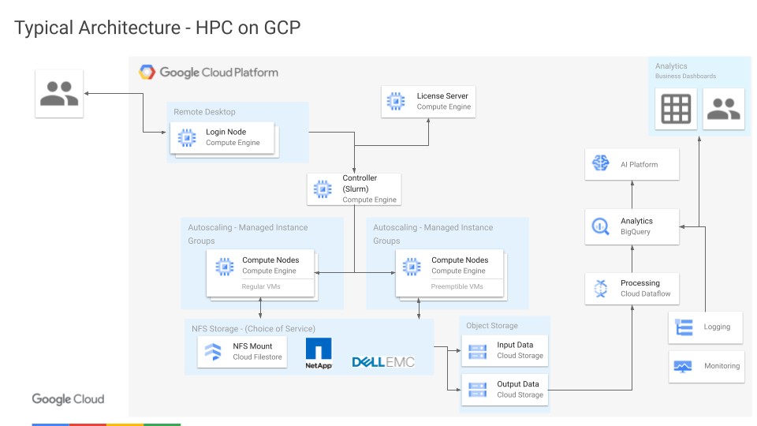
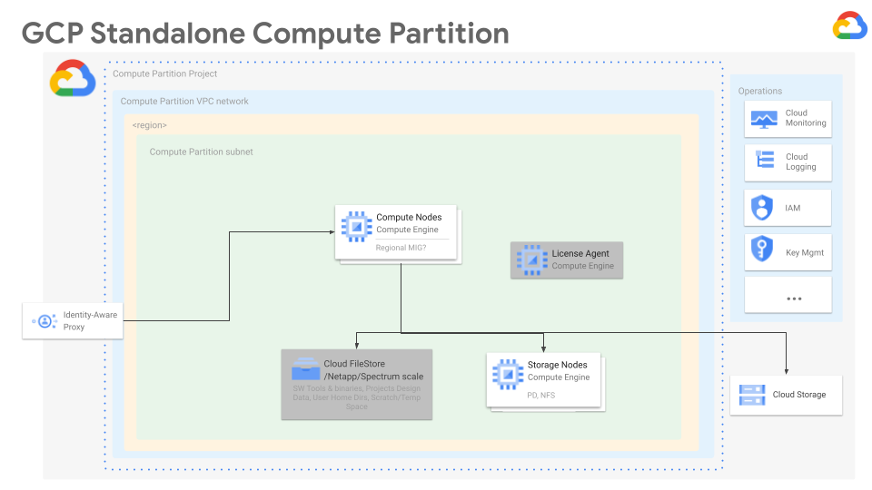

# Creating Custom VertexAI Workbench Instances for Scientific Machine Learning

The goal here is to establish a base set of workbench instances and learn how
to customize them to your needs.

## Examples

Here are some tutorials showing how to:
- [Create and use Vertex AI Workbenches](example-simple-workbench.md)
- [Create a custom post-install script to customize instances you spin up](example-custom-post-install.md)
- [Build your own custom images for Vertex AI Workbenches](example-build-custom-workbench.md)

## What's next

Beyond the basics covered above we'll add more examples here to explore how to
use these workbench instances as a "base of operations" for managing your SciML
resources in Google Cloud.  From a workbench, you can drive Vertex AI pipelines
to train custom models as well as use tools such as the HPC Toolkit (rebranded
as the Google Supercomputer Toolkit I think) to spin up and manage HPC clusters
to run simulation workloads on accelerated hardware.

TODO Add a couple of pretty pictures here showing how to use the notebook as a 
base of operations

Please note that these are provided only as examples to help guide
infrastructure planning and are not intended for use in production. They are
deliberately simplified for clarity and lack significant details required for
production-worthy infrastructure implementation.

## References

There are many exciting directions to take to learn how to use Google Cloud for
SciML workloads.

Learn about what's new in
- [Vertex AI with Gemini](https://cloud.google.com/vertex-ai/docs/start/introduction-unified-platform)
- [High Performance Computing (HPC) on GCP](https://cloud.google.com/solutions/hpc?hl=en)
- Scientific Machine Learning on Google Cloud

