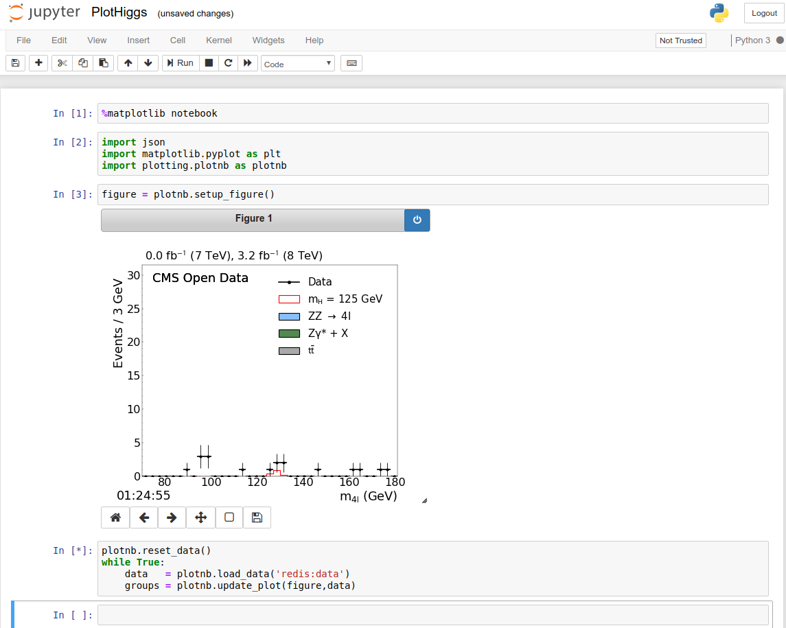

# Rediscovering the Higgs boson using the Google Cloud Platform

On 4 July 2012, Researchers at the European Organization for Nuclear Research (CERN)
[announced](https://cms.cern/physics/higgs-boson/observation-new-particle-mass-125-gev)
that they had recorded events in the ATLAS and CMS experiments at the Large
Hadron Collider (LHC) that had properties consistent with a new particle, the
Higgs boson.

The corresponding analysis required compute hardware spread throughout
datacenters around the world, with significant human coordination across the
sites. It was a massive effort requiring lots of people, compute, and storage
resources.

On 8 October 2013, the Nobel Prize in Physics was
[awarded](https://www.nobelprize.org/prizes/physics/2013/summary/) to Francois
Englert and Peter W. Higgs based on this discovery.

On 21 May 2019, Researchers at CERN, 
Lukas Heinrich ([`@lukasheinrich_`](https://twitter.com/lukasheinrich_)) and 
Ricardo Rocha ([`@ahcorporto`](https://twitter.com/ahcorporto))
[demonstrated](https://kccnceu19.sched.com/event/MRyv/keynote-reperforming-a-nobel-prize-discovery-on-kubernetes-ricardo-rocha-computing-engineer-lukas-heinrich-physicist-cern)
([video](https://www.youtube.com/watch?v=2PRGUOxL36M),
[slides](https://static.sched.com/hosted_files/kccnceu19/14/Lukas%20Heinrich-Ricardo%20Rocha%20May%2021%20Evening.pdf))
how they (re)-performed the Higgs discovery using Kubernetes running on the
Google Cloud Platform (GCP) using over 20k cores and over 70 TB of data stored
on Google Cloud Storage.  They completed this analysis onstage in a matter of
minutes.


## Objectives

In this tutorial you will use the GCP Cloud Shell to set up and run a small
end-to-end slice of that prize-winning analysis!


### The Analysis

Scientists learn about the fundamental building blocks (forces and particles)
of nature by essentially smashing things together and watching what happens.
They use a type of 
[particle accelerator](https://en.wikipedia.org/wiki/Particle_accelerator)
(unsurprisingly called a [Collider](https://en.wikipedia.org/wiki/Collider)!)
to run these experiments.  This is the "C" in LHC.

The experiments that led to the Higgs discovery at the LHC used Protons as the
particles to smash.  Protons are classified by their behavior and composition
as [Hadrons](https://en.wikipedia.org/wiki/Hadron), the "H" in LHC.

Particle collisions show very different things at different energy scales.
I.e., depending how _hard_ the particles are smashed together or equivalently
how fast they are going before they collide. The Protons in the LHC were sped
up to really high energy levels before being smashed together.  They were going
so fast that the energy levels of the resulting collisions were in the 7-8
[TeV](https://en.wikipedia.org/wiki/Electronvolt) range!  The accelerator used
to speed them up to such high energy has a tunnel with a circumference of 27km
(17mi), the "L" in LHC.

A great deal of hard work and ingenuity goes into building the massive
apparatus needed to perform these experiments and, just as importantly, to
measure the results of the collisions involved.

You can't actually see a subatomic particle with the naked eye.  You detect it
using devices which interact with the particle in known and measurable ways.
These particle detectors might simply prove that a particle was there,
count how many particles it sees, or might be able to determine some additional
particle properties such as charge, mass, etc.  All of which depends heavily on
the particles being measured as well as the detectors being used to do the
measuring.

Some particles such as the Higgs boson are so hard to detect that you have to
work at the problem indirectly.  The basic approach in this case is that a
Higgs boson quickly decays into other sets of particles, so look for _those_
particles. You can infer information about the Higgs boson involved in the
process by looking at the overall shower of particle interactions from the
collision.  You try to determine how many of the interactions seen can happen
with or without a Higgs boson present.

In order to detect particles that the Higgs boson will decay into. You compare
the shower of decay events
([decay channels](https://cms.cern/physics/higgs-boson-terms-and-definitions))
that you expect to see through non-Higgs-related (a.k.a.,
[Background](https://cms.cern/physics/higgs-boson-terms-and-definitions))
processes with the actual events measured in the detectors.

That's exactly the
[analysis](https://cms.cern/physics/higgs-boson/observation-new-particle-mass-125-gev)
you'll do here.  You run jobs that compare simulations of background
events/processes to actual observed data from detectors. If the observed
data contains a
[statistical excess](https://cms.cern/physics/higgs-boson-terms-and-definitions)
of any of these particular decay channels, then that indicates the presence of
a new particle, the Higgs.


### The Infrastructure

Google Kubernetes Engine (GKE) provides the core infrastructure you'll use to
run analysis jobs against a selection of the
[CERN Open Data](http://opendata.cern.ch/)
available in Google Cloud Storage (GCS).


## Costs

This tutorial uses billable components of Google Cloud Platform, including:

- Kubernetes Engine
- Container Registry
- Cloud Storage

You can use the
[Pricing Calculator](https://cloud.google.com/products/calculator)
to generate a cost estimate based on your projected usage.


## Before you begin

Start by opening
[https://console.cloud.google.com/](https://console.cloud.google.com/)
in a browser.

Create a new GCP Project using the
[Cloud Resource Manager](https://console.cloud.google.com/cloud-resource-manager).
The project you create is just for this tutorial, so you'll delete it below
when you're done.

You will need to
[enable billing](https://support.google.com/cloud/answer/6293499#enable-billing)
for this project.

You will also need to enable the Kubernetes Engine (GKE) service for this account

[Enable Tutorial Services](https://console.cloud.google.com/flows/enableapi?apiid=container.googleapis.com,containerregistry.googleapis.com,containeranalysis.googleapis.com,cloudresourcemanager.googleapis.com)
    
Next, make sure the project you just created is selected in the top of the
Cloud Console

    screenshot of cloud console project selection [Editor: please help]

Then open a Cloud Shell associated with the project you just created

[Launch Cloud Shell](https://console.cloud.google.com/?cloudshell=true)

It's important that the current Cloud Shell project is the one you just
created.  Verify that

    echo $GOOGLE_CLOUD_PROJECT

shows that new project.

All commands in this tutorial are run from this Cloud Shell.


## Download the code

Clone the tutorial repository

    git clone https://github.com/mmm/scientific-computing-examples
    cd examples/higgs

You'll manage cloud infrastructure resources for this tutorial using
[Terraform](https://terraform.io/) which is already installed and configured in
your GCP Cloud Shell. This helps both to keep things initially as simple as
possible, but also to promote best practices when working in the cloud.


## Create a Kubernetes cluster

Create the cluster

    cd terraform/gke-cluster
    terraform init
    terraform plan
    terraform apply


This will take a few minutes for the Kubernetes nodes to come up.


## Get cluster credentials

Once the previous commands complete, get credentials for that new cluster using
the following command:

    gcloud container clusters get-credentials higgs-tutorial --region us-central1

Set the cluster name and region if you've changed these default values.


## Deploy Jupyter and Redis

Next lay down the basic framework of tools that are needed before any job runs
are kicked off

    cd ../prep
    terraform init
    terraform plan
    terraform apply


This will spin up a Redis cache, a Jupyter notebook server, and a Kubernetes
Daemonset to pre-pull all the docker images needed for analysis.

When the `terraform apply` completes, copy the output Jupyter URL and open that
in a new browser window.


## Kick off Kubernetes jobs

Now, back in your Cloud Shell, kick off the actual analysis jobs

    cd ../jobs
    terraform init
    terraform plan
    terraform apply

which essentially loads up a separate kubernetes job for each datafile in the
dataset.


## Visualize results

You can visualize results in a Jupyter notebook as the jobs run.  From the
browser window opened earlier, click to open the `PlotHiggs.ipynb` notebook.
Click through and execute all cells in the notebook to make sure everything
is running.

Note that the default behavior in this notebook is to render a graph of test
data and _not_ the data coming directly from our jobs. This test data plot is
what we would see if we were to run the 26,000 core cluster against the _full_
74TB dataset used on stage.


For this tutorial, you've spun up a small cluster and pulled only a bite-sized
slice of the data. This enables you to work through the end-to-end analysis
while still keeping costs down.

Once you've validated your notebook runs, now point it at the Redis cache used
to store the outputs of your actual job runs. Within the Jupyter notebook,
change the cell containing the main plot loop

```python
plotnb.reset_data()
while True:
    data   = plotnb.load_data()
    groups = plotnb.update_plot(figure,data)
```

to `load_data` from the Redis cache instead of the default test dataset

```python
plotnb.reset_data()
while True:
    data   = plotnb.load_data('redis:data')
    groups = plotnb.update_plot(figure,data)
```

When you re-execute that cell you'll see a plot of the data just processed on
your tutorial-sized cluster.




## Cleaning up

To avoid incurring charges to your Google Cloud Platform account for the
resources used in this tutorial:

### Delete the project using the GCP Cloud Console

The easiest way to clean up all of the resources used in this tutorial is
to delete the project that you initially created for the tutorial.

Caution: Deleting a project has the following effects:
- Everything in the project is deleted. If you used an existing project for
  this tutorial, when you delete it, you also delete any other work you've done
  in the project.
- Custom project IDs are lost. When you created this project, you might have
  created a custom project ID that you want to use in the future. To preserve
  the URLs that use the project ID, such as an appspot.com URL, delete selected
  resources inside the project instead of deleting the whole project.

1. In the GCP Console, go to the Projects page.

    GO TO THE PROJECTS PAGE

2. In the project list, select the project you want to delete and click Delete
   delete.
3. In the dialog, type the project ID, and then click Shut down to delete the
   project.

### Deleting resources using Terraform

Alternatively, if you added the tutorial resources to an _existing_ project, you
can still clean up those resources using Terraform.

From the `jobs` sub-directory, run

    terraform destroy

then

    cd ../prep
    terraform destroy

and

    cd ../gke-cluster
    terraform destroy


## What's next

There are so many exciting directions to take to learn more about what you've
done here!

- Physics.  You can dig further into
  [Physics at CERN](https://home.cern/science/physics).

- Infrastructure.  Learn more about
  [Cloud](https://cloud.google.com/),
  [Kubernetes](https://cloud.google.com/kubernetes),
  High Performance Computing (HPC) on GCP
  [reference architectures](https://cloud.google.com/solutions/hpc/) and 
  [posts](https://cloud.google.com/blog/topics/hpc).

- Software development.  Learn more about
  [CERN software](https://ep-dep-sft.web.cern.ch).

- Hardware development.  Learn more about the detectors used in experiments at CERN
  like [CMS](https://home.cern/science/experiments/cms),
  [ATLAS](https://home.cern/science/experiments/atlas),
  and [other experiments](https://home.cern/science/experiments)!

