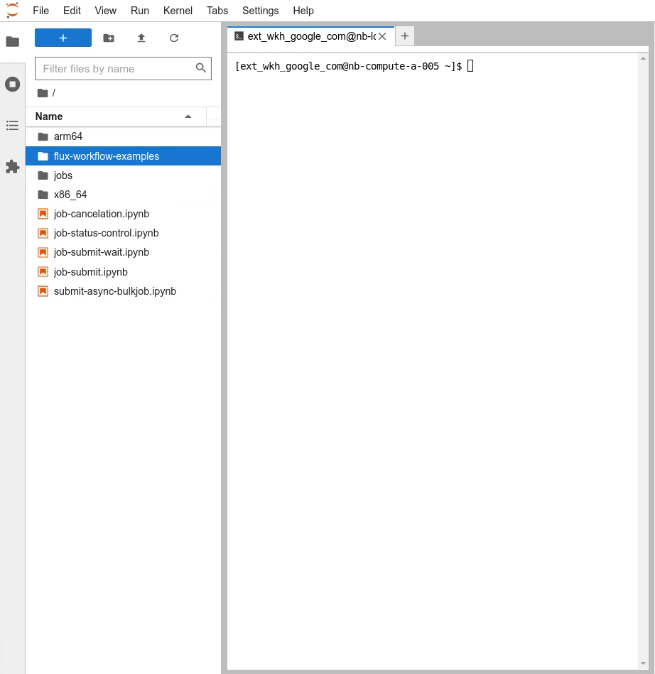

# Flux Framework Containers Example

This example demonstrates how to work with containers in a [flux-framework](https://flux-framework.org/) cluster on GCP. We use
the [apptainer](http://apptainer.org/) container runtime to illustrate running a [jupyter notebook](https://jupyter.org/) and
show how to use [Spack](https://spack.io/) to define a [GROMACS](https://www.gromacs.org/), build it, and then use it in a flux
allocation.

## Deployment

Initialize the deployment with the command:

```bash
terraform init
```

Make a copy of the `containers.tfvars.example` file:

```bash
cp containers.tfvars.example containers.tfvars
```

Modify the containers.tfvars to specify the desired configuration. For example you may want more than
one login node, you may want a different machine_type, and/or you may want to add another node pool, etc.

Note that each of the node pool specified in the `compute_node_specs` array specify a `boot_script` _install-apptainer.sh_.
That script is executed the first time each of the nodes in the node pool is booted and, in this example, installs
`apptainer`.

Deploy the cluster with the command:

```bash
terraform apply -var-file containers.tfvars
```

Once the `terraform apply` command completes you can log into your cluster using the command:

```bash
gcloud compute ssh containers-login-001
```

Check the state of the cluster with the command:

```bash
flux resource list
```

When the cluster is ready you will see output that looks like:

```bash
     STATE PROPERTIES NNODES   NCORES    NGPUS NODELIST
      free x86-64,e2       1        2        0 containers-login-001
      free n2,x86-64       6       48        0 containers-compute-a-[001-006]
 allocated                 0        0        0 
      down                 0        0        0
```

## Jupyter Lab

There are multiple ways to install the software required to run Jupyter notebooks. The [notebooks]() example
installs it via the `Miniconda` [conda](https://docs.conda.io/en/latest/) installer. That approach gives you
access to the[flux-framework Python API](https://flux-framework.readthedocs.io/projects/flux-core/en/latest/python/index.html) 
from your notebook environment. In this example you will use `apptainer` to run a container that packages up
Jupyter and the [SciPy](https://scipy.org/) library of fundamental algorithms for scientific computing. Using
a container allows you to start the Jupyter server with a single command.

Two steps are required to run notebooks with JupyterLab. First you need to start the `jupyter-lab` server and then create an [ssh tunnel](https://www.ssh.com/academy/ssh/tunneling) so that you can access the interface via a web browser.

You will need the IP address of the node in your allocation where your flux shell is running. Execute the following
command to get the correct address:

```bash
ip a | grep '/32' | awk '{print($2)}' | cut -d'/' -f1
```

You will also need remember the flux cluster username that the OS Login mechanism assigned you:

```bash
echo $USER
```

To request an allocation of nodes for your Jupyter Lab server use the command:

```bash
flux alloc -N4 --requires=n2
```

Flux will allocate four nodes and give you a new shell on one of them.


Now you can start the JupyterLab server. Starting the server is accomplished with the command:

```bash
apptainer run docker://jupyter/scipy-notebook
```

which will produce output similar to:

```bash
INFO:    Converting OCI blobs to SIF format
INFO:    Starting build...
Getting image source signatures
Copying blob cd2cab437071 done  
Copying blob 6e3729cf69e0 done  
Copying blob 6cca258439f9 done  
Copying blob 4f4fb700ef54 done  
... lots of warnings you can ignore ...
023/01/06 17:33:13  info unpack layer: sha256:4f4fb700ef54461cfa02571ae0db9a0dc1e0cdb5577484a6d75e68dc38e8acc1
2023/01/06 17:33:13  info unpack layer: sha256:ce6ba77cb23dfeec6972db83de1c1075fce49e125055619e492262faeacd124a
2023/01/06 17:33:13  info unpack layer: sha256:a24d4c2daa985abc185d1d155ff1fd7036bcd10e3e5d388e4770811434a5793e
2023/01/06 17:33:13  info unpack layer: sha256:4f4fb700ef54461cfa02571ae0db9a0dc1e0cdb5577484a6d75e68dc38e8acc1
INFO:    Creating SIF file...
INFO:    fuse: warning: library too old, some operations may not work
[WARN  tini (31245)] Tini is not running as PID 1 and isn't registered as a child subreaper.
Zombie processes will not be re-parented to Tini, so zombie reaping won't work.
To fix the problem, use the -s option or set the environment variable TINI_SUBREAPER to register Tini as a child subreaper, or run Tini as PID 1.
Entered start.sh with args: jupyter lab
WARNING: no write access to /home/jovyan. Try starting the container with group 'users' (100), e.g. using "--group-add=users".
Executing the command: jupyter lab
[I 2023-01-06 17:34:00.864 ServerApp] jupyter_server_terminals | extension was successfully linked.
[I 2023-01-06 17:34:00.868 ServerApp] jupyterlab | extension was successfully linked.
[W 2023-01-06 17:34:00.870 NotebookApp] 'ip' has moved from NotebookApp to ServerApp. This config will be passed to ServerApp. Be sure to update your config before our next release.
[W 2023-01-06 17:34:00.870 NotebookApp] 'port' has moved from NotebookApp to ServerApp. This config will be passed to ServerApp. Be sure to update your config before our next release.
[W 2023-01-06 17:34:00.870 NotebookApp] 'port' has moved from NotebookApp to ServerApp. This config will be passed to ServerApp. Be sure to update your config before our next release.
[I 2023-01-06 17:34:00.872 ServerApp] nbclassic | extension was successfully linked.
[I 2023-01-06 17:34:01.230 ServerApp] notebook_shim | extension was successfully linked.
[I 2023-01-06 17:34:01.606 ServerApp] notebook_shim | extension was successfully loaded.
[I 2023-01-06 17:34:01.607 ServerApp] jupyter_server_terminals | extension was successfully loaded.
[I 2023-01-06 17:34:01.608 LabApp] JupyterLab extension loaded from /opt/conda/lib/python3.10/site-packages/jupyterlab
[I 2023-01-06 17:34:01.608 LabApp] JupyterLab application directory is /opt/conda/share/jupyter/lab
[I 2023-01-06 17:34:01.611 ServerApp] jupyterlab | extension was successfully loaded.
[I 2023-01-06 17:34:01.618 ServerApp] nbclassic | extension was successfully loaded.
[I 2023-01-06 17:34:01.618 ServerApp] Serving notebooks from local directory: /home/ext_wkh_google_com
[I 2023-01-06 17:34:01.618 ServerApp] Jupyter Server 2.0.6 is running at:
[I 2023-01-06 17:34:01.618 ServerApp] http://containers-compute-a-003:8888/lab?token=2974ada880fddab36a46cc19ca954bcdc60cd777ff9e87fc
[I 2023-01-06 17:34:01.618 ServerApp]  or http://127.0.0.1:8888/lab?token=2974ada880fddab36a46cc19ca954bcdc60cd777ff9e87fc
[I 2023-01-06 17:34:01.618 ServerApp] Use Control-C to stop this server and shut down all kernels (twice to skip confirmation).
[C 2023-01-06 17:34:01.632 ServerApp] 
    
    To access the server, open this file in a browser:
        file:///home/a_user_name/.local/share/jupyter/runtime/jpserver-31272-open.html
    Or copy and paste one of these URLs:
        http://containers-compute-a-003:8888/lab?token=2974ada880fddab36a46cc19ca954bcdc60cd777ff9e87fc
     or http://127.0.0.1:8888/lab?token=2974ada880fddab36a46cc19ca954bcdc60cd777ff9e87fc
```

Note that the jupyter server is listening on the localhost interface of the node where your flux shell is running.
To access the interface from a web browser on your local machine you will create an `ssh tunnel` that forwards a
connection made to a port on your local machine to the node in your allocation where the jupyter server is running.

Use this command to setup the ssh tunnel from your local machine to your server host:

```bash
export FLUX_CLUSTER_USERNAME=# The flux cluster username you retrieved earlier #
export JUPYTER_SERVER_IP=# The ip address of the node in your allocation where the jupyter server is listening #

gcloud compute ssh nb-login-001 --zone us-central1-a -- -L 8888:localhost:8888 -t ssh -L 8888:localhost:8888 ${FLUX_CLUSTER_USERNAME}@${JUPYTER_SERVER_IP}
```

When the tunnel is established you can access the jupyter lab server running in your allocation via a 
web browser on your local machine. Just paste either of the `http` URLs from the output juypter-lab
start up output into a local web browser and press `enter`. You should see output that looks like



## GROMACS

[GROMACS](https://www.gromacs.org/) is an open-source software suite for high-performance molecular
dynamics and output analysis. It is one of the most widely used codes in chemistry, the primary focus
being dynamical simulations of biomolecules. In this example you will use Apptainer to build GROMACS 
in a [Singularity Image Format](https://github.com/apptainer/sif#the-singularity-image-format-sif) container.
Once built you can store the container in Google Cloud Storage and use it across various environments and/or
share it with other members of your team.

### Spack

[Spack](https://spack.io/) is a flexible package manager supporting multiple versions, configurations, platforms,
and compilers. Spack allows you to build software stacks in a broad range of languages, for a host of processor
architectures. Spack also supports containerization by translating its `environment` specifications into 
container definitions for `containerd` and `apptainer` runtimes.

### Apptainer Definition File Generation

An Apptainer Definition File (or “def file” for short) is like a set of blueprints explaining how to build a custom container. 
It includes specifics about the base OS to build or the base container to start from, software to install, environment variables 
to set at runtime, files to add from the host system, and container metadata. You can create a definition file manually using
a text editor, or you can use Spack to generate one for you from a (much simpler) Spack environment file descibing the software 
package(s) the container will hold.

To create a Spack environment file for GROMACS use the command:

```bash
cat <<"SPACK_YAML" > spack.yaml
spack:
  specs:
  - gromacs+mpi
  - mpich

  container:
    # Select the format of the recipe e.g. docker,
    # singularity or anything else that is currently supported
    format: singularity

    # Sets the base images for the stages where Spack builds the
    # software or where the software gets installed after being built..
    images:
      os: "ubuntu:22.04"
      spack: develop

    # Whether or not to strip binaries
    strip: true

    # Additional system packages that are needed at runtime
    os_packages:
      final:
      - libgomp1
      - libatomic1

    # Labels for the image
    labels:
      app: "gromacs"
      mpi: "mpich"

    singularity:
      runscript: /opt/view/bin/gmx_mpi $@
EOF
```

Now generate the Apptainer definition file using:

```bash
spack containerize > gromacs.def
```

### Container Building

Use the generated definition file to build an Apptainer container with the command:

```bash
flux submit -N1 --requires=n2 apptainer build gromacs.sif gromacs.def
```

The command above creates a flux `job` that runs the Apptainer build command on one of the compute nodes in the cluster. Building
GROMACS and all its dependencies will take 30-45 minutes on a 16 core instance. To check on the status of the job use the
command:

```bash
flux jobs
```

which will produce output similar to:

```bash
       JOBID USER     NAME       ST NTASKS NNODES     TIME INFO
  ƒdPvPvoUb1 ext_wkh_ apptainer   R      1      1   8.272s containers-compute-a-006
```

When the job completes successfully you will have a `gromacs.sif` file which you can use to run molecular dynamics simulations. To
learn how to use GROMACS you can work through the tutorial material found [here](). You can use the `gromacs.sif` just as you would
the GROMACS `gmx_mpi` command anywhere Apptainer is installed, e.g., any of the flux cluster compute nodes. For example the
command:

```bash
flux run -N1 --requires=n2 ./gromacs.sif -h
```

will result in output similar to:

```bash
                    :-) GROMACS - gmx_mpi, 2022.4-spack (-:

Executable:   /opt/software/linux-ubuntu22.04-cascadelake/gcc-11.3.0/gromacs-2022.4-37mgirkqjkdq3su46dgntzovpevmjesg/bin/gmx_mpi
Data prefix:  /opt/software/linux-ubuntu22.04-cascadelake/gcc-11.3.0/gromacs-2022.4-37mgirkqjkdq3su46dgntzovpevmjesg
Working dir:  /home/a_user_id
Command line:
  gmx_mpi -h

SYNOPSIS

gmx [-[no]h] [-[no]quiet] [-[no]version] [-[no]copyright] [-nice <int>]
    [-[no]backup]

OPTIONS

Other options:

 -[no]h                     (no)
           Print help and quit
 -[no]quiet                 (no)
           Do not print common startup info or quotes
 -[no]version               (no)
           Print extended version information and quit
 -[no]copyright             (no)
           Print copyright information on startup
 -nice   <int>              (19)
           Set the nicelevel (default depends on command)
 -[no]backup                (yes)
           Write backups if output files exist

Additional help is available on the following topics:
    commands    List of available commands
    selections  Selection syntax and usage
To access the help, use 'gmx help <topic>'.
For help on a command, use 'gmx help <command>'.

GROMACS reminds you: "A robot will be truly autonomous when you instruct it to go to work and it decides to go to the beach instead." (Brad Templeton)
```

Now you can work through one or more of the GROMACS tutorials found [here](http://www.mdtutorials.com/gmx/)
