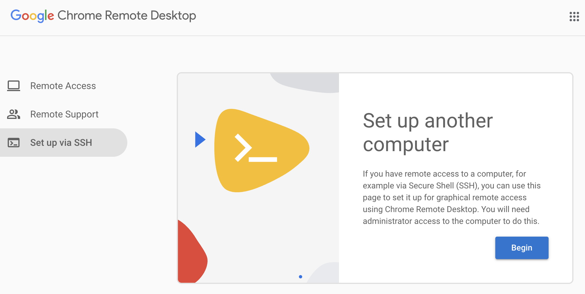
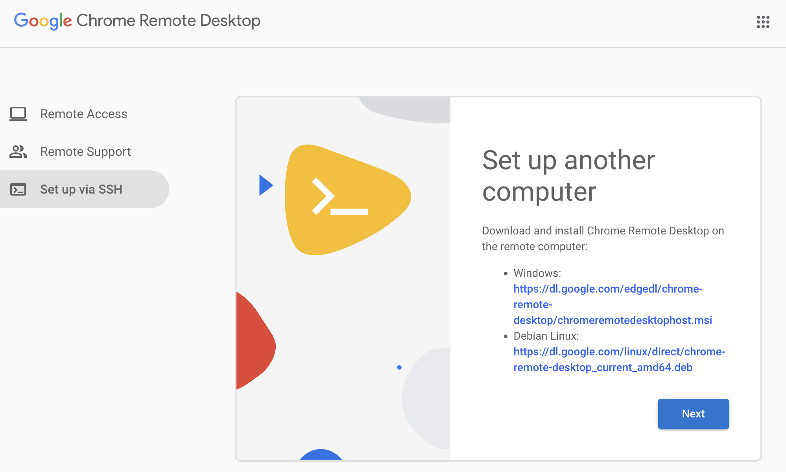
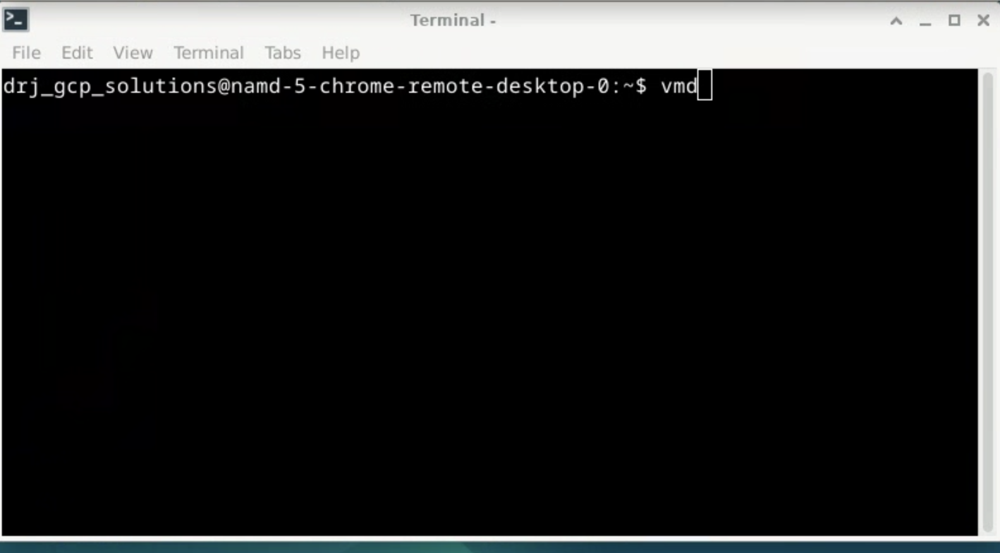
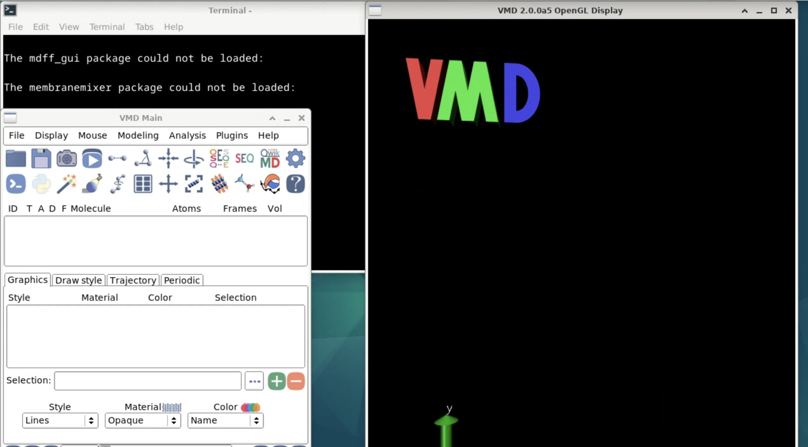
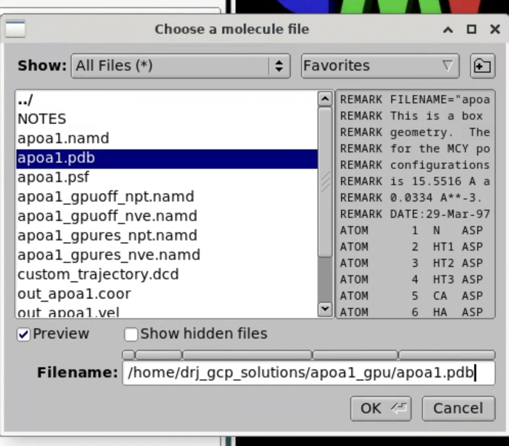
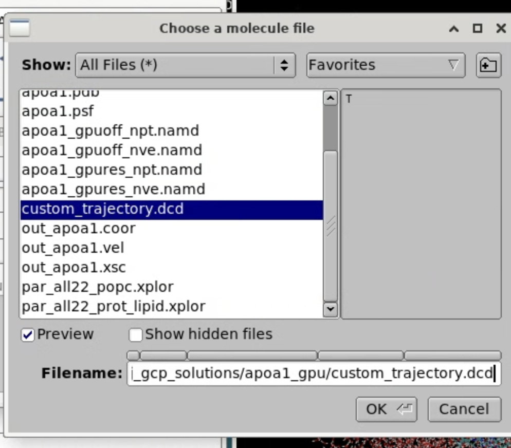
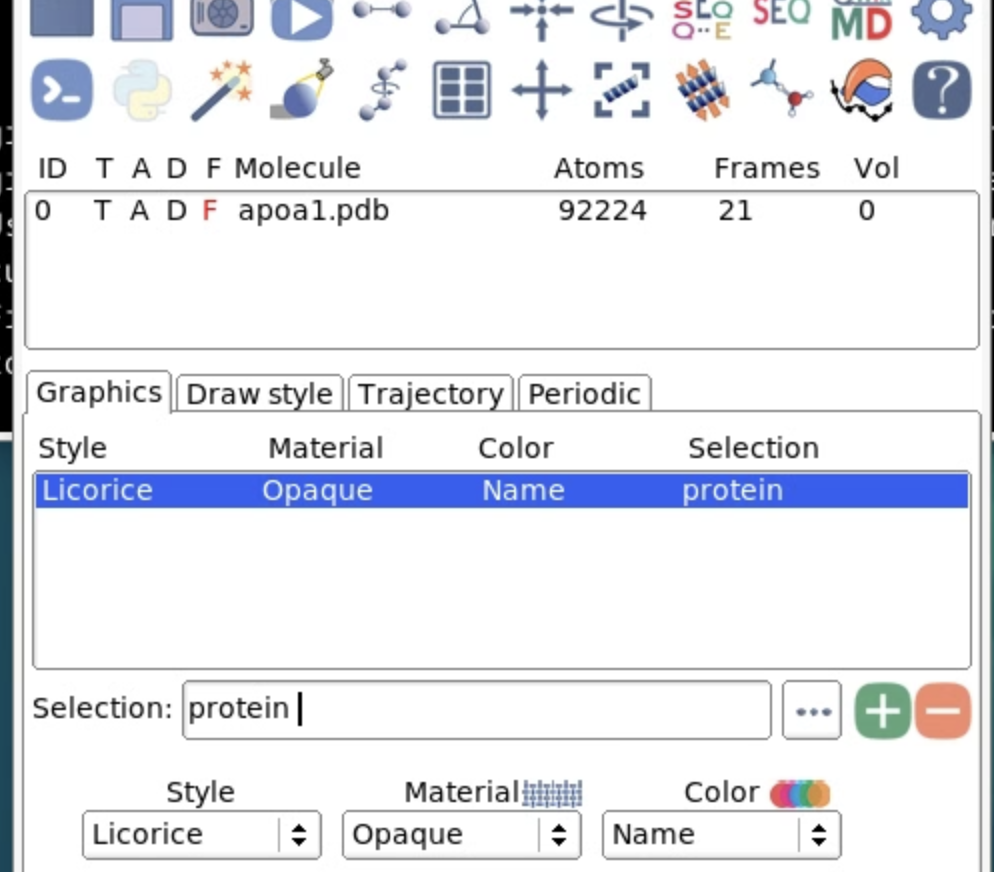
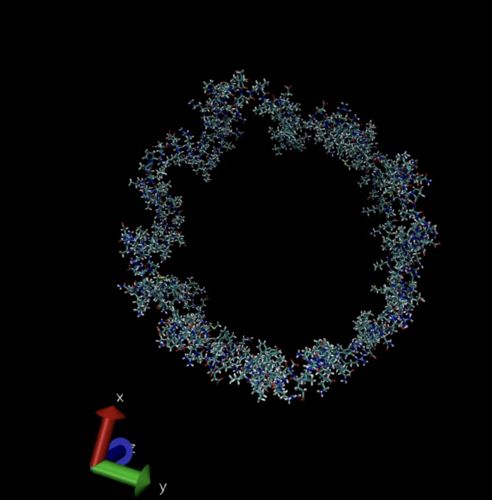

# Running NAMD APOA1 Benchmark using GPUs with Google Cloud Cluster Toolkit


This guide provides instructions on how to run [NAMD](http://www.ks.uiuc.edu/Research/namd/), a molecular dynamics simulation program, on GPUs using the  [Google Cloud Cluster Toolkit](https://cloud.google.com/cluster-toolkit/docs/setup/configure-environment), running the [NVIDIA NAMD Container](https://catalog.ngc.nvidia.com/orgs/hpc/containers/namd) on [Slurm](https://slurm.schedmd.com/overview.html)

# Getting Started
## Explore costs

In this tutorial, you use several billable components of Google Cloud. 

* Compute Engine
* Filestore
* Cloud Storage

You can evaluate the costs associated to these resources using the [Google Cloud Pricing Calculator](https://cloud.google.com/products/calculator)


## Review basic requirements

Some basic items are required to get started.

* A Google Cloud Project with billing enabled.
* Basic familiarity with Linux and command-line tools.

For installed software, you need a few tools.

* [Google Cloud SDK](https://cloud.google.com/sdk/docs/install) installed and configured.
* [Terraform](https://learn.hashicorp.com/tutorials/terraform/install-cli) installed.
* [Git](https://git-scm.com/book/en/v2/Getting-Started-Installing-Git) installed.

These tools are already installed within the [Google Cloud Shell](https://shell.cloud.google.com/) and Cloud Shell Editor.

## Install the Google Cloud Cluster toolkit

To run the remainder of this tutorial, you must:

* Set up [Cloud Cluster Toolkit](https://cloud.google.com/cluster-toolkit/docs/setup/configure-environment). During the setup ensure you enable all the required APIs, and permissions, and grant credentials to Terraform. Also ensure you clone and build the Cloud Cluster Toolkit repository in your local environment.
* Review the [best practices](https://cloud.google.com/cluster-toolkit/docs/tutorials/best-practices).

# Run NAMD on Google Cloud

Running the NAMD platform on Google Cloud using the Cluster Toolkit requires a few steps.

## Clone the Scientific Computing Example repo
Clone the tutorial repository.
```
    git clone https://github.com/GoogleCloudPlatform/scientific-computing-examples
    cd hcls/namd-on-slurm
```
## Run the Cluster Toolkit blueprint
Execute the `gcluster` command. If the Toolkit is installed in the \$HOME directory, the command is:

```
~/cluster-toolkit/gcluster deploy namd-slurm.yaml \
--skip-validators="test_apis_enabled"  --auto-approve \
  --vars project_id=$(gcloud config get project)
```
## Connect to Slurm
The remaining steps in this tutorial will all be run on the Slurm cluster login node. SSH is used to connect to the login node, and `gcloud` offers an option for SSH connections.
```
gcloud compute ssh --zone "us-central1-c" "namdslurm-slurm-login-001" --project $(gcloud config get project)
```
An alternative to SSH connection to the login node is to connect from the 
[Cloud Console](https://console.cloud.google.com/compute/instances). Click on the `SSH` link.
## Download sample configuration
To run NAMD, configuration files are required. NVIDIA shares information for the APOA1 benchmark. Download the benchmark configuration. 
```
wget -O - https://gitlab.com/NVHPC/ngc-examples/raw/master/namd/3.0/get_apoa1.sh | bash
```
>> For convenience, the deployment has created  download shell script to get this data and the data for STMV. Available on the login node.
```
cp /tmp/namd/* .
bash get_data.sh
```

## Convert Docker to Apptainer
[Apptainer](https://apptainer.org/) is recommended for HPC applications. The published 
[NVIDIA Docker Container](https://catalog.ngc.nvidia.com/orgs/hpc/containers/namd)
is easily convereted to Apptainer compatible formats.

`apptainer` has been previously installed on the cluster.

The `apptainer build` command will convert a docker container into apptainer format. The Slurm `sbatch` will
run this step if `namd.sif` is not present, so this step is optional since the `sbatch` file contains 
commands to download and convert the container.
```
export NAMD_TAG=3.0-beta5
apptainer build namd.sif docker://nvcr.io/hpc/namd:$NAMD_TAG 
```
This may take 5 minutes.

## Slurm batch file
To submit a job on Slurm, a Slurm Batch script must be created.

>> For convenience, the deployment created several Slurm batch job files to run these samples.
These were already copied over with the command:
```
cp /tmp/namd/* .
```
## Create the Slurm batch file
Alternatively, you can create the batch file manually.  Use the `heredoc` below. Cut and paste
the follwing into your Slurm login terminal. 

```
tee namd_apoa1.job << JOB
#!/bin/bash
#SBATCH --job-name=namd_ipoa1_benchmark
#SBATCH --partition=a2x1
#SBATCH --output=%3A/out_%a.txt
#SBATCH --error=%3A/err.txt
#SBATCH --array=0
#SBATCH --gres=gpu:1 
#

dirs=("apoa1_gpu/apoa1_gpures_npt.namd")

# Build SIF, if it doesn't exist
if [[ ! -f namd.sif ]]; then
  export NAMD_TAG=3.0-beta5
  apptainer build namd.sif docker://nvcr.io/hpc/namd:$NAMD_TAG 
fi
echo "Running: "  ${dirs[$SLURM_ARRAY_TASK_ID]}
apptainer run --nv namd.sif namd3 +devices 0 +setcpuaffinity ${dirs[$SLURM_ARRAY_TASK_ID]}
JOB
```
This creates a Slurm batch file named namd.job

## Submit the job
The command to submit a job with Slurm is [sbatch](https://slurm.schedmd.com/sbatch.html). 

Submit the job.
```
sbatch namd_apoa1.job
```
The command to see the jobs in the Slurm batch queue is [squeue](https://slurm.schedmd.com/squeue.html)
```
squeue
```
The output lists running and pending jobs.
```
             JOBID PARTITION     NAME     USER ST       TIME  NODES NODELIST(REASON)
                 6        a2 namd_ipo drj_gcp_ CF       0:02      1 namdslurm-a2nodeset-0
```
## Review the output
As configured in the `namd_apoa1.job` file, the standard output of the Slurm job is directed to
`###/out.txt`, where `###` is the JOBID. When the job is complete, it will not be visible
in the  `squeue` output and the output files will be present.


You can use `head` to see the start of the output.
```
head 001/out*.txt 
```
Shows:
```
==========
== CUDA ==
==========

CUDA Version 12.3.0

Container image Copyright (c) 2016-2023, NVIDIA CORPORATION & AFFILIATES. All rights reserved.

This container image and its contents are governed by the NVIDIA Deep Learning Container License.

```

You can use `tail` to see the end of the output.
```
tail 001/out*.txt 
```
Shows:
```
WRITING EXTENDED SYSTEM TO OUTPUT FILE AT STEP 10000
WRITING COORDINATES TO OUTPUT FILE AT STEP 10000
The last position output (seq=-2) takes 0.030 seconds, 0.000 MB of memory in use
WRITING VELOCITIES TO OUTPUT FILE AT STEP 10000
The last velocity output (seq=-2) takes 0.026 seconds, 0.000 MB of memory in use
====================================================

WallClock: 13.387387  CPUTime: 13.058638  Memory: 0.000000 MB
[Partition 0][Node 0] End of program
```

## Visualization with VMD
To visualize the molecules being simulations with NAMD, we use a recommended tool, 
[VMD](https://www.ks.uiuc.edu/Research/vmd/). Since VMD is a Graphical User Interface (GUI), 
it requires Virtual Desktop Infrastructure (VDI). Google offers a VDI solution free of cost called 
[Chrome Remote Desktop](https://remotedesktop.corp.google.com/access/) (CRD). 
This Cluster Toolkit deployment of NAMD creates a VM with CRD and VMD preinstalled.

### Authenticate Chrome Remote Desktop

As above, you can login to the CRD VM using the Google Cloud Console. 
SSH is used to connect to the login node, and `gcloud` offers an option for SSH connections.
```
gcloud compute ssh --zone "us-central1-c" "namdslurm-chrome-remote-desktop-0" --project $(gcloud config get project)
```
An alternative to SSH connection to the login node is to connect from the 
[Cloud Console](https://console.cloud.google.com/compute/instances). Click on the `SSH` link.

Once you are connected to the CRD VM, you must open a new window on the CRD page:

https://remotedesktop.google.com/headless

1. Click on "Begin": 
1. Then click on "Next": 
1. Then click on "Authorize": 
1. Finally, "Copy to Clipboard" for Debian: 

### Paste authentication string into CRD VM Shell

The content that was copied in the previous step should be pasted into the shell on the CRD VM:


If successful, you will be prompted for a 6 digit PIN.

### Connect to the VM via CRD
With authentication established, you can connect to the VM via CRD. Open the webpage.

https://remotedesktop.google.com/access

The NAMD VDI VM should be visible in a list of VMs.


You can now see a full Linux WM interface. 

### Start the VMD application

The following steps will allow you to start the VMD application and visualize the
simulated molecule.

1. Select the "Terminal Emulator": <p/> 
1. Type "vmd" in the terminal window: 
1. The VMD UI is now visible: 
1. Select "New Molecule" from the "VMD Main" menu : 
1. "Browse" to "apoa1_gpu" and select "apoa1.pdb". Click "Okay" then "Load": 
1. "Browse" to select "custom_trajectory.dcd". Click "Okay" then "Load": 
1. Update the Graphics to reflect the image, "licorice" ... "protein": 
1. Finally, click the "Play" button to view the animation: 
1. The animation: 


## Discussion

The tutorial demonstrated how to run the NAMD molecular dynamics IPOA1 benchmark 
using NVIDIA GPUs on Google Cloud. The infrastructure was deploye3d by the Cluster Toolkit,
and the NVIDIA container was deployed by Apptainer. 

Slurm was used as a workload manager. Simulation output was viewed in a text file.

# Clean up

To avoid incurring charges to your Google Cloud account for the resources used in this tutorial, either delete the project containing the resources, or keep the project and delete the individual resources.

## Destroy the HPC cluster

To delete the HPC cluster, run the following command:
```
~/cluster-toolkit/gcluster destroy namd-slurm --auto-approve
```
When complete you will see output similar to:

Destroy complete! Resources: xx destroyed.

**CAUTION**: This approach will destroy all content including the fine tuned model.

## Delete the project

The easiest way to eliminate billing is to delete the project you created for the tutorial.

To delete the project:

1. **Caution**: Deleting a project has the following effects:
    * **Everything in the project is deleted.** If you used an existing project for the tasks in this document, when you delete it, you also delete any other work you've done in the project.
    * **Custom project IDs are lost.** When you created this project, you might have created a custom project ID that you want to use in the future. To preserve the URLs that use the project ID, such as an **<code>appspot.com</code></strong> URL, delete selected resources inside the project instead of deleting the whole project.
2. If you plan to explore multiple architectures, tutorials, or quickstarts, reusing projects can help you avoid exceeding project quota limits.In the Google Cloud console, go to the <strong>Manage resources</strong> page. \
[Go to Manage resources](https://console.cloud.google.com/iam-admin/projects)
3. In the project list, select the project that you want to delete, and then click <strong>Delete</strong>.
4. In the dialog, type the project ID, and then click <strong>Shut down</strong> to delete the project.

