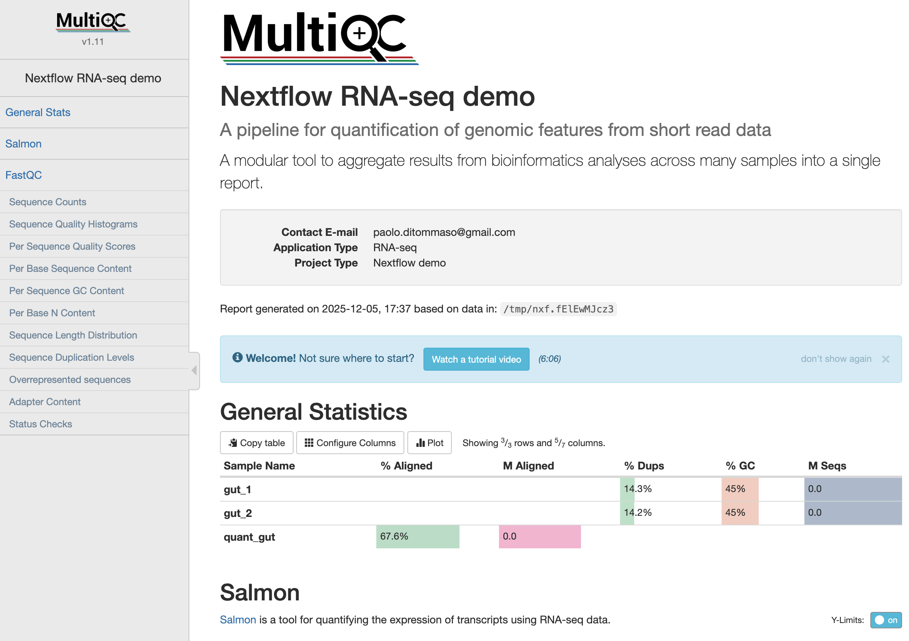

# Nextflow RNA-Seq Batch Processing on GCP

This repository contains the necessary configuration to deploy a Google Cloud Platform (GCP) environment for running Nextflow RNA-Seq batch processing workflows using the GCP Cluster Toolkit.
## Objectives

By completing this tutorial, you'll learn how to do the following:

* Install the GCP Cluster Toolkit
* Run a Cluster Toolkit blueprint to deploy a VM with Nextflow installed
* Run a Nextflow pipeline on Google Cloud Batch
* View the results on Google Cloud Storage
* Clean up to avoid incurring additional charges.

## Installation Instructions for GCP Cluster Toolkit (formerly Cloud HPC Toolkit)

The GCP Cluster Toolkit is an open-source tool from Google Cloud designed to simplify the deployment of high-performance computing (HPC) environments.

To install the `gcluster` CLI tool, follow these steps:

1.  **Prerequisites**:
    * Ensure you have `gcloud` installed
    * Ensure you have `go language` installed.
    * Sign in to your Google Cloud account.
    * Select or create a Google Cloud project and ensure billing is enabled.

2.  **Set up your Google Cloud CLI (gcloud CLI)**:
    *   Configure your default project:
        ```bash
        gcloud config set project YOUR_PROJECT_ID
        ```
    *   Authenticate the gcloud CLI:
        ```bash
        gcloud auth login
        ```

3.  **Grant  Credentials**:
    *   Grant user access credentials to Terraform for authentication:
        ```bash
        gcloud auth application-default login
        ```

5.  **Clone the Cluster Toolkit GitHub repository**:

You can clone the Cluster Toolkit repo into your home directory.

```bash
cd ~
git clone https://github.com/GoogleCloudPlatform/cluster-toolkit
```

6.  **Build the Cluster Toolkit binary**:
   > Make sure you have `make` installed.

    ```bash
    cd cluster-toolkit
    make
    ```
    This will build the `gcluster` binary.

7.  **Verify the installation**:
    ```bash
    ./gcluster --version
    ```
    This command should output the version of the `gcluster` tool. You may want to add the `gcluster` binary to your system's PATH.

## Deployment instructions for the Toolkit blueprint

This blueprint deploys a virtual machine (VM) configured for Nextflow RNA-Seq batch processing. The deployment uses the `gcluster` CLI tool with the provided configuration files.

This deployment will do the following:

* Create a VM: `nextflow-0`
* Create a GCS bucket for nextflow work and results
* Install Java and Nextflow
* Provide the correct Cloud Batch profile for `nextflow.config`

1.  **Clone the Cluster Toolkit GitHub repository**:

    ```bash
    cd ~
    git clone https://github.com/GoogleCloudPlatform/scientific-computing-examples.git
    ```

1.  **Navigate to the blueprint directory**:
    Assuming you are in your home directory:
    ```bash
    cd scientific-computing-examples/hcls/nexflow/rnaseq-batch
    ```

2.  **Deploy the Nextflow VM**:
    Use the `gcluster deploy` command with the `nextflow-vm.yaml` blueprint file.

    This assumes you have correctly set the project ID correctly in the steps above.

    ```bash
    ~/cluster-toolkit/gcluster deploy ./nextflow-vm.yaml --auto-approve  --vars project_id=$(gcloud config get project)
    ```

3.  **Access the deployed VM**:
    Once the deployment is complete, `gcluster` will provide instructions on how to connect to your newly created Nextflow VM, typically via SSH.
    The `gcloud command is another option:
    ```
    gcloud compute ssh --zone "us-central1-a" "nextflow-0" --project $(gcloud config get project) --tunnel-through-iap
    ```
## Wait for Toolkit deployment to complete
When you connect to the Nextflow VM, you will likely see a notice that the Cluster Toolkit is still running:
```
** WARNING **: The Cluster Toolkit startup scripts are currently running.
```
When the Toolkit deployment is compelete, you see a message indicating this. When the deployment is complete, you can run `nextflow`.
```
nextflow -version
```
There will be output.
```
      N E X T F L O W
      version 23.04.1 build 5866
      created 15-04-2023 06:51 UTC 
      cite doi:10.1038/nbt.3820
      http://nextflow.io
```

## Running the Nextflow pipeline:
Most of the Nextflow configuration has been populated automatically. To run the 
common demo code for RNASEQ, the instructions are simple.
> This section requires you to be SSH'ed to the `nextflow-0` VM.

1. **Clone the RNASEQ repo**
```
git clone https://github.com/nextflow-io/rnaseq-nf.git
cd rnaseq-nf
```
2. **Update `nextflow.config`** with details from the Toolkit. 
This step inserts the configuration information generated during deployment into
the nextflow.config file.
```
 sed -i '/profiles {/r /var/tmp/gcb-nextflow.config' nextflow.config 
```

3. **Run the pipeline** 

```
 nextflow run . -profile gcb
```
While the pipeline is running, there should be output.
```
R N A S E Q - N F   P I P E L I N E
===================================
transcriptome: gs://rnaseq-nf/data/ggal/transcript.fa
reads        : gs://rnaseq-nf/data/ggal/gut_{1,2}.fq
outdir       : results

Uploading local `bin` scripts folder to gs://bucket-nf-nextflow-03878153/nextflow_work/tmp/27/b7fdaaa0e382b93496d3851855cdcc/bin
executor >  google-batch (2)
[00/e74407] process > RNASEQ:INDEX (transcript) [  0%] 0 of 1
[5c/ab3da2] process > RNASEQ:FASTQC (gut)       [  0%] 0 of 1
[-        ] process > RNASEQ:QUANT              -
[-        ] process > MULTIQC                   -
```
The output will indicate when the job is completed.

## Viewing the output
The output from the Google Cloud Batch / Nextflow run is on the GCS bucket that was
created by the Toolkit deployment. To find the exact location of the output data, you can
search the log file.
```
grep workDir .nextflow.log | tail -n 1
```
The output should look something like:
```
Dec-05 17:38:05.140 [Task monitor] DEBUG n.processor.TaskPollingMonitor - Task completed > TaskHandler[id: 4; name: MULTIQC; status: COMPLETED; exit: 0; error: -; workDir: gs://bucket-nf-nextflow-03878153/nextflow_work/6f/4b6db20407906639febf2033f1c62a]
```
You can view the contents of that GCS bucket directory with `gcloud`. 

> Be sure to use your own "gs://..." path.
```
gcloud storage ls gs://bucket-nf-nextflow-03878153/nextflow_work/6f/4b6db20407906639febf2033f1c62a
```
The results are in the `multiqc_report.html` file.  To view that file, you can create a URL to view the HTML file.
The URL will take the GCS path, that starts with "gs://". Replace "gs://" with "https://storage.cloud.google.com/"

The result would look something like:
```
https://storage.cloud.google.com/bucket-nf-nextflow-59c0d516/nextflow_work/0d/a8b886b2247e21d2fc40f6e9a93d07/multiqc_report.html

```
This should show:


Optionally, you can view the bucket content from the Google Cloud Console:

https://console.cloud.google.com/storage/browser/

Navigate to the path found above.

## Congratulations!

You have succeeded in the completing the tutorial.

## Cleaning up
### Destroy the deployment (Optional)
> **Use with caution**, as this will delete all provisioned resources.

To remove all resources created by this blueprint, navigate to the deployment directory and run:
```bash
gcluster destroy nextflow
```

### Stop the Nextflow VM
The less destructive option to save costs is to "stop" the VM.
```
 gcloud compute instances stop nextflow-0 --zone=[YOUR_ZONE] --project=[YOUR_PROJECT_ID]
 ```
 Note that you will still be billed for any data stored on the GCS bucket.