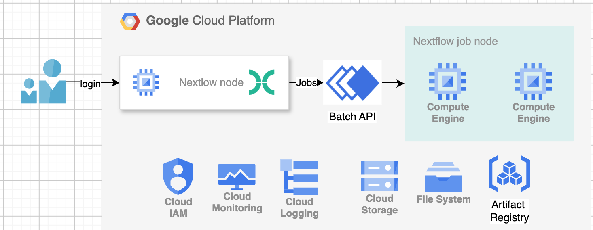

# Nextflow on Google Batch

This guide provides instructions for running the Nextflow [`rnaseq-nf`](https://github.com/nextflow-io/rnaseq-nf) pipeline sample on Google Cloud Batch.

## References

*   [Nextflow Installation](https://docs.seqera.io/nextflow/install)
*   [Nextflow on Google Cloud Batch](https://docs.cloud.google.com/batch/docs/nextflow)

## Reference Architecture



## Prerequisites

1.  **Install Nextflow:**
    Follow the instructions from the [Nextflow installation guide](https://docs.seqera.io/nextflow/install). User can operate Nextflow at "anywhere" including Cloud Shell, Cloudtop or local machine.

2.  **Enable Google Cloud APIs:**
    Ensure you have enabled the necessary APIs in your GCP project:
    *   Batch API (`batch.googleapis.com`)
    *   Compute Engine API (`compute.googleapis.com`)
    *   Cloud Storage API (`storage.googleapis.com`)

3.  **Google Cloud Storage (GCS) Bucket:**
    Create a GCS bucket to store the pipeline's work directory and output files.

4.  **Authentication:**
    Authenticate your environment with Google Cloud:
    ```bash
    gcloud auth login
    gcloud auth application-default login
    ```

## Configuration

User can leverage the `nextflow.config` file in this repo to configure Nextflow to use Google Batch as the executor

Please make sure updating the following parameters according to your GCP setup.

```bash
params.bucketname  = '<your bucket name>'
params.gcp_project = '<your gcp project>'
params.network_name = 'default'
params.subnet_name = 'default'
params.location = 'us-central1'
```

## Clone the sample rnaseq-nf git

git clone https://github.com/nextflow-io/rnaseq-nf.git

## Running the sample rnaseq-nf Pipeline

Once you have your `nextflow.config` file set up, you can run the `rnaseq-nf` sample pipeline with the following command:

```bash
./nextflow run rnaseq-nf -profile google-batch
```

Nextflow will automatically parse the config in the current directory, provision the necessary resources on Google Cloud Batch, and execute the pipeline steps.

## Monitoring

You can monitor the status and execution of your pipeline jobs directly in the Google Cloud Batch Jobs Console.