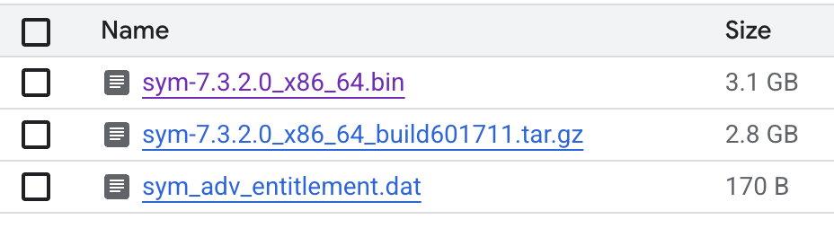

# IBM Spectrum Symphony on Google Cloud

> ## This deployment is released as alpha. It is not fully tested or guaranteed to work off the shelf.

This project provides a blueprint for deploying an IBM Spectrum Symphony cluster on Google Cloud Platform using the [Google Cloud HPC Toolkit](https://cloud.google.com/hpc-toolkit). The blueprint automates the provisioning of the necessary infrastructure and the installation and configuration of Symphony.

## Overview

This blueprint deploys a Symphony cluster consisting of a master node and a set of compute nodes. The compute nodes are managed by Managed Instance Groups (MIGs) and can be dynamically scaled based on workload demands. The deployment leverages various Google Cloud services, including:

*   **Google Compute Engine (GCE):** For creating virtual machines for the master and compute nodes.
*   **Google Cloud Storage:** For storing Symphony installation files.
*   **Packer:** For creating a custom machine image with Symphony pre-installed.
*   **Google Cloud Pub/Sub:** For monitoring GCE instance events to enable autoscaling.

## Directory Structure

*   `symphony.yaml`: The main HPC Toolkit blueprint file that defines the architecture and configuration of the Symphony cluster.
*   `modules/`: Contains reusable Terraform modules for creating various resources like VPCs, instance templates, and Pub/Sub topics.
*   `resources/`: Contains configuration files and scripts used during the deployment, such as the Google Ops Agent configuration and Symphony host provider plugins.
*   `scripts/`: Contains shell scripts for installing and configuring Symphony on the master and compute nodes.

## Prerequisites

1.  **Google Cloud SDK:** Make sure you have the `gcloud` CLI installed and configured.
2.  **Google Cloud HPC Toolkit:** This project relies on the HPC Toolkit. Follow the [installation instructions](https://cloud.google.com/hpc-toolkit/docs/setup/install-hpc-toolkit) to set it up.
3.  **IBM Spectrum Symphony Installers:** You need to download the IBM Spectrum Symphony installation files and place them in a local directory. You will also need to upload them to a Google Cloud Storage bucket.

The copied files should look like:



## Deployment

1.  **Configure the Blueprint:** Open the `symphony_deployment.yaml` file and edit the variables under the `vars` section to match your environment. At a minimum, you need to set `project_id` and `sym_source_bucket`.

2.  **Deploy the Cluster:** Use the `ghpc` command to deploy the Symphony cluster:

    ```bash
    ghpc create symphony.yaml --auto-approve
    ```

3.  **Access the Cluster:** Once the deployment is complete, you can SSH into the master node to manage the Symphony cluster.

4. You can connect to the Symphony UI by forwarding the 8080 port on your Master VM. Something like below, where you change the project and other elements.
```
gcloud compute ssh --zone "us-central1-a" "symphony1-master-0" --project "ai-infra-jrt-2" --tunnel-through-iap -- -L 8080:localhost:8080
```

## Configuration

The `symphony.yaml` file is the single source of truth for the cluster's configuration. You can modify this file to change the machine types, disk sizes, network settings, and other parameters of the cluster.

For more information on configuring the HPC Toolkit, refer to the [official documentation](https://cloud.google.com/hpc-toolkit/docs).
