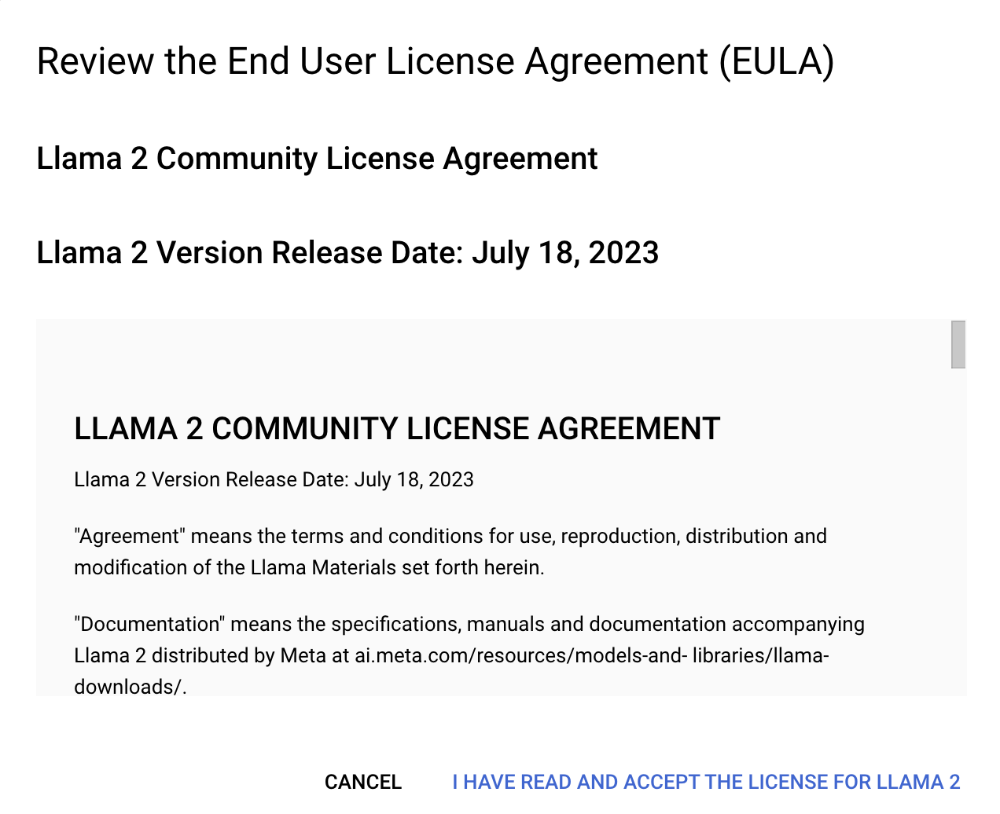
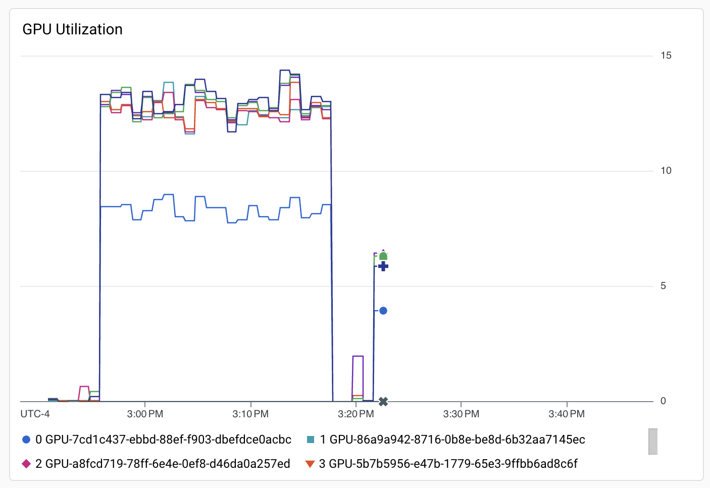

**Run Llama 2 Fine Tuning on Slurm**


---

This tutorial shows you how to deploy an HPC cluster and run a _fine tuning_ workload using the [Slurm](https://slurm.schedmd.com/overview.html) scheduler. The HPC cluster deployment is done by using Cloud HPC Toolkit and this tutorial assumes you've already [set up Cloud HPC Toolkit](https://cloud.google.com/hpc-toolkit/docs/setup/configure-environment) in your environment.

Cloud HPC Toolkit is open-source software offered by Google Cloud which makes it easy for you to deploy high performance computing (HPC) environments. [Llama 2](https://huggingface.co/meta-llama/Llama-2-7b) is a collection of pretrained and fine-tuned generative text models ranging in scale from 7 billion to 70 billion parameters. In this tutorial we work with Llama-2-7b, using 7 billion parameters.


### Objectives

In this tutorial, you will learn how to complete the following task:


* Use Cloud HPC Toolkit to create a g2 node cluster suitable for running Llama 2 fine tuning
* Run Llama 2 fine tuning


### Costs

**Important:** In this document, you use the following billable components of Google Cloud:


* Compute Engine
* Filestore
* Cloud Storage

To generate a cost estimate based on your projected usage, use the [pricing calculator](https://cloud.google.com/products/calculator).


### Before you begin


* Set up [Cloud HPC Toolkit](https://cloud.google.com/hpc-toolkit/docs/setup/configure-environment). During the setup ensure you enable all the required APIs, and permissions, and grant credentials to Terraform. Also ensure you clone and build the Cloud HPC Toolkit repository in your local environment.
* Review the [best practices](https://cloud.google.com/hpc-toolkit/docs/tutorials/best-practices).
* **Ensure you have [sufficient quota](https://cloud.google.com/docs/quotas/view-manage) to run**. Verify at the Cloud Console by clicking the link

        https://console.cloud.google.com/iam-admin/quotas

* Search for:

        	nvidia_l4_gpus

> Using the command line, you can find the same information.
```
gcloud compute regions describe us-central1 --format="table(quotas:format='table(metric,limit,usage)')" | grep ^NVIDIA_L4_GPUS
```

* If you don't have a quota for at least 8 L4 GPUs, you must request at least 8. This is done by:
    * Selecting the quota on the list and clicking "Edit Quota".
    * Details are here: ​​https://cloud.google.com/docs/quotas/view-manage

**IMPORTANT**: If you have quota in a specific region, you must modify the YAML file (hpc-slurm-llama2.yaml) to represent this. It is trying by default to create your cluster in US-EAST1


### Open your CLI

In one of the following development environments, set up the gcloud CLI:


* **Cloud Shell**: to use an online terminal with the gcloud CLI already set up, activate Cloud Shell.
    * Activate Cloud Shell on this page.
    * At the bottom of this page, a Cloud Shell session starts and displays a command-line prompt. It can take a few seconds for the session to initialize.
* **Local shell**: to use a local development environment, [install](https://cloud.google.com/sdk/docs/install) and [initialize](https://cloud.google.com/sdk/docs/initializing) the gcloud CLI.
    * Authenticate using `gcloud auth login`


### Deploy the HPC cluster with Slurm

From the Cloud Shell (or local shell), complete the following steps:


1. Setup the  [Cloud HPC Toolkit](https://cloud.google.com/hpc-toolkit/docs/setup/configure-environment).
2. Clone the Github repository.

           git clone https://github.com/GoogleCloudPlatform/scientific-computing-examples.git


3. Change to the AI Infrastructure directory

  cd llam2-finetuning-slurm

4. Execute  

 	ghpc create hpc-slurm-llama2.yaml --vars project_id=$(gcloud config get-value project) -w --vars bucket_model=llama2

5. Use the ``ghpc deploy`` command to begin automatic deployment of your cluster:

    ghpc deploy hpc-slurm-llama2 --auto-approve

6. This process can take over 30 minutes.
7. If the run is successful, the output is similar to the following:

Apply complete! Resources: 39 added, 0 changed, 0 destroyed.


8. To view the created VMs, run the `gcloud compute instances list` command:

gcloud compute instances list | grep slurm

9. You are now ready to submit jobs to your HPC cluster.

### Connect to the Slurm HPC cluster

To run the Llama 2 fine tuning on your cluster, you must login to the Slurm _login _node. This is done by clicking on the `SSH` button using the Google Cloud Console.


1. Connect to the Console at https://console.cloud.google.com/compute/instances
2. Click on `SSH` next to the `login` node

Or you can connect from the command line.

```
gcloud compute ssh $(gcloud compute instances list --filter "name ~ login" --format "value(name)") --tunnel-through-iap --zone us-east1-b
```

Download the llama2-7b models from Hugging Face

On the Slurm login node, you can download the Hugging Face models to your local directory on the cluster. 


1. Accept the EULA for Llama 2

    https://console.cloud.google.com/vertex-ai/publishers/google/model-garden/llama2





    Click "I HAVE READ AND ACCEPT THE LICENSE FOR LLAMA 2".

2. Download the model with `gsutil`. In your home directory on the login node run the command.

  gcloud storage cp --recursive gs://vertex-model-garden-public-us-central1/llama2/llama2-7b-hf/ .

The result will be a directory in your home directory.


### Run the Slurm `sbatch` command to submit your job

From the Slurm login node, you can now submit the job to the cluster, assuming you completed the following:

* Ensured you have quota
* Downloaded the models to the local drive on the cluster

The Slurm batch script is provided on the Google Cloud Storage bucket and is run using the `sbatch` command.

	sbatch /data_bucket/fine-tune-slurm.sh

You can validate the job is in queue with the `squeue` command.

	squeue

The output will look something like the following.


```
             JOBID PARTITION     NAME     USER ST       TIME  NODES NODELIST(REASON)
                 3        g2 llama2-f drj_gcp_  R       3:23      1 hpcslurmll-g2node-0
```


#### Job Status

If there is an "R" in the column labeled "ST" (for status), the job is running. Other statuses are explained on the [SchedMD Slurm website.](https://slurm.schedmd.com/squeue.html#SECTION_JOB-STATE-CODES)

A status of "CF" may indicate there are no resources available to run the job at present. The great thing about Slurm, is it will keep trying until a VM can is created. In this case you are trying to create a [g2-standard-96](https://cloud.google.com/compute/docs/gpus#nvidia_l4_vws_gpus) VM, which is in considerable demand.


### View the running job metrics with Cloud Monitoring

When `squeue` indicates the job is running (status "R"), you can view the results at the Monitoring Dashboard created by the HPC Toolkit.

https://console.cloud.google.com/monitoring/dashboards

Select the dashboard with the name **"GPU: hpc-slurm-llama2". **This dashboard has GPU Utilization like the following.




### View completed job

Once the job has completed, the activity will no longer be visible in the `squeue` Slurm output. You will have an output file in your home directory, `slurm-N.out`, where "N" is the job number as seen in the `squeue` output.  You can view the last 20 lines of the output file with the `tail` command:

tail -20 slurm-N.out

Where "N" is the value seen in the `squeue` output for JOBID.  The output will be something similar to the following.


```
$ tail -20 slurm-3.out 
{'loss': 3.2061, 'grad_norm': 1.1988024711608887, 'learning_rate': 1.360544217687075e-06, 'epoch': 0.99}
{'loss': 3.4498, 'grad_norm': 3.532811403274536, 'learning_rate': 1.020408163265306e-06, 'epoch': 0.99}
{'loss': 3.472, 'grad_norm': 2.02884578704834, 'learning_rate': 6.802721088435375e-07, 'epoch': 1.0}
{'loss': 3.99, 'grad_norm': 1.4774787425994873, 'learning_rate': 3.4013605442176873e-07, 'epoch': 1.0}
{'loss': 3.5852, 'grad_norm': 1.2340481281280518, 'learning_rate': 0.0, 'epoch': 1.0}
{'train_runtime': 1326.2408, 'train_samples_per_second': 1.781, 'train_steps_per_second': 0.445, 'train_loss': 3.733814854136968, 'epoch': 1.0}
Output from test prompt

<s> 
In the late action between Generals

Brown and Riall, it appears our men fought
with a courage and perseverance, that would
do honor to the best troops in the world. The
whole army, notwithstanding the repeated
attacks and repeated efforts, were repulsed
with great loss. The enemy, to whom it
was so difficult to get within the reach of our
guns, suffered severely in their
```


The output from the test prompt indicates output relevant to the fine tuning of the Llama 2 model.


### Clean up

To avoid incurring charges to your Google Cloud account for the resources used in this tutorial, either delete the project containing the resources, or keep the project and delete the individual resources.


#### Destroy the HPC cluster

To delete the HPC cluster, run the following command:


```
ghpc deploy hpc-slurm-llama2 --auto-approve
```


When complete you will see output similar to:

Destroy complete! Resources: xx destroyed.

**CAUTION**: This approach will destroy all content including the fine tuned model.


#### Delete the project

The easiest way to eliminate billing is to delete the project you created for the tutorial.

To delete the project:


1. **Caution**: Deleting a project has the following effects:
    * **Everything in the project is deleted.** If you used an existing project for the tasks in this document, when you delete it, you also delete any other work you've done in the project.
    * **Custom project IDs are lost.** When you created this project, you might have created a custom project ID that you want to use in the future. To preserve the URLs that use the project ID, such as an **<code>appspot.com</code></strong> URL, delete selected resources inside the project instead of deleting the whole project.
2. If you plan to explore multiple architectures, tutorials, or quickstarts, reusing projects can help you avoid exceeding project quota limits.In the Google Cloud console, go to the <strong>Manage resources</strong> page. \
[Go to Manage resources](https://console.cloud.google.com/iam-admin/projects)
3. In the project list, select the project that you want to delete, and then click <strong>Delete</strong>.
4. In the dialog, type the project ID, and then click <strong>Shut down</strong> to delete the project.