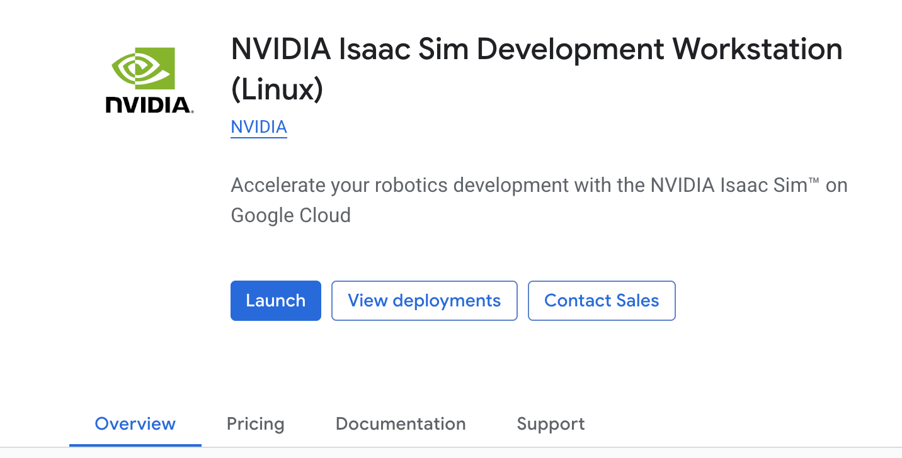
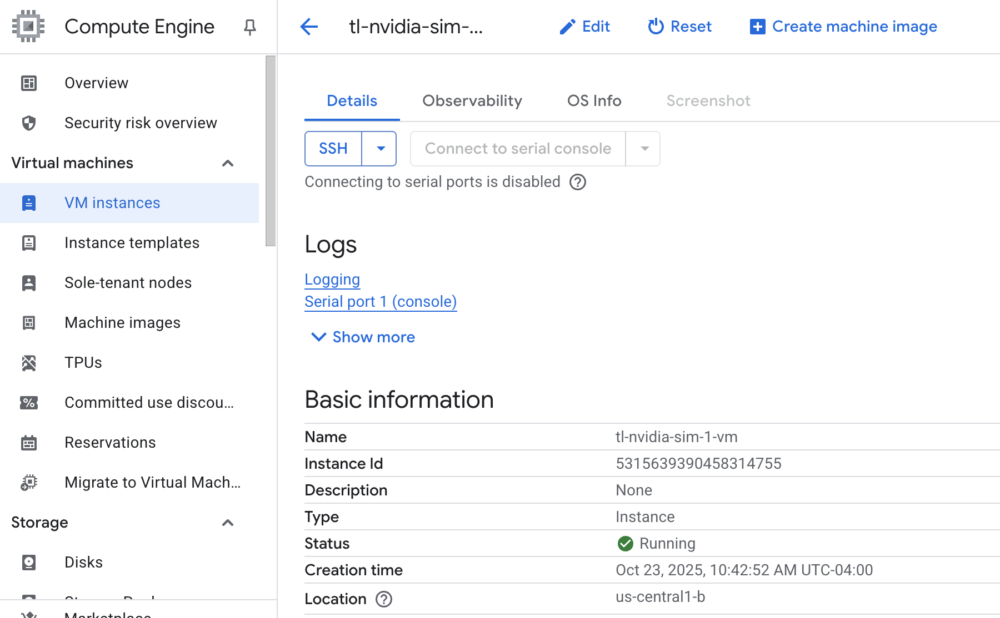
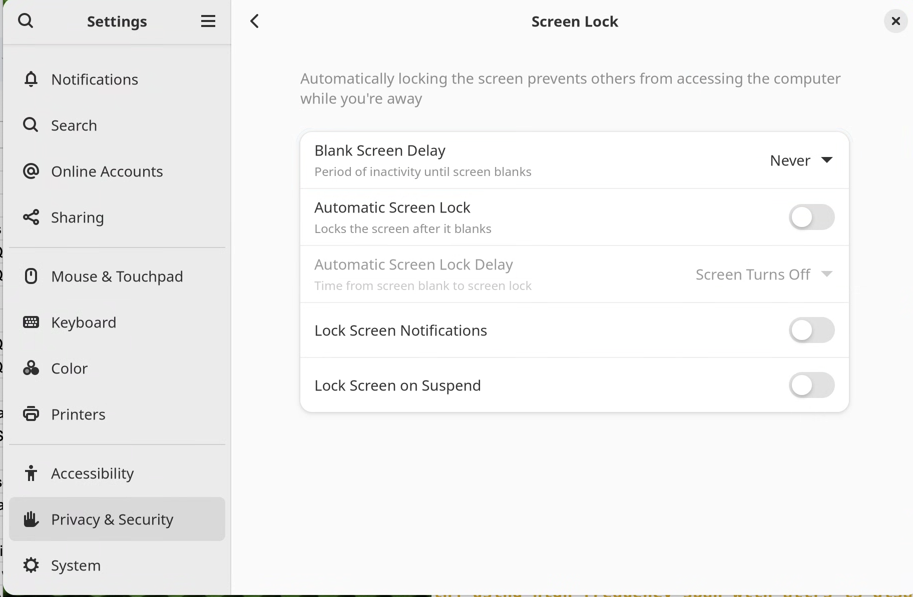
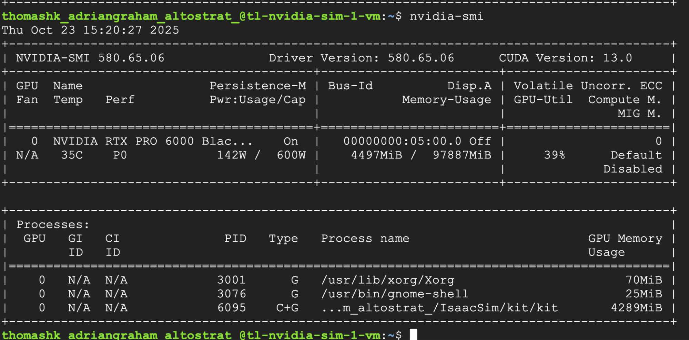

# NVIDIA Isaac Sim Development Workstation (Linux) with Chrome Remote Desktop:

This document focus on using Chrome Remote Desktop to access the NVIDIA Isaac Sim Development Workstation (Linux) with G4 instance type from GCP Marketplace, providing secure access to the graphical user interface.

### Reference:

[https://blogs.nvidia.com/blog/nvidia-google-cloud-enterprise-ai-industrial-digitalization](https://blogs.nvidia.com/blog/nvidia-google-cloud-enterprise-ai-industrial-digitalization/)

[https://cloud.google.com/architecture/chrome-desktop-remote-on-compute-engine](https://cloud.google.com/architecture/chrome-desktop-remote-on-compute-engine)


### Discussion:

Chrome remote desktop is NOT designed for heavy graphical applications. We see about 60 - 120 fps with NVIDIA Isaac Sim Desktop usage which is sufficient for normal usage. FPS can vary with network connection and other variables.  If user experience is not acceptable, we suggest using Thinlinc [link](https://github.com/thomasnyc/GCP_NVIDIA_Isaac_Sim_Thinlinc/tree/main) or HP anywhere. [Link](https://cloud.google.com/compute/docs/virtual-workstation/linux) 


## Setup a NVIDIA Isaac Sum Development Workstation (Linux)


1. Netvigate to the GCP MarketPlace and search for “Nvidia Issac Sim”, Select NVIDIA Isaac Sim Development Workstation (Linux)


2. Hit the Launch button to launch the system. 




3. Update the fields accordingly. Including the machine name, required GPU(s), storage and VPC etc. Then hit the Deploy button.


 	The machine shall be deployed. Wait for a few minutes.


4. The machine is running and ready for SSH. 




## Install Chrome Remote Desktop on the VM instance


1. In the SSH window for your VM instance, add the Linux Chrome Remote Desktop repository to your apt package list, and install the chrome-remote-desktop package.

- Git clone this repo to the home directory
- chmod 755 the file "setup_crd.sh"
```
chmod 755 setup_crd.sh
```
- Execute the setup_crd.sh script
```
./setup_crd.sh
```

## Configure and start the Chrome Remote Desktop service

To start the remote desktop server, you need to have an authorization key for the Google Account that you want to use to connect to it:


1. In the Google Cloud console, go to the **VM Instances** page: \
[Go to the VM Instances page](https://console.cloud.google.com/compute/instances/)
2. Connect to your instance by clicking the **SSH** button.
3. On your local computer, using the Chrome browser, go to the Chrome Remote Desktop command line setup page: \
[https://remotedesktop.google.com/headless \
](https://remotedesktop.google.com/headless)
4. If you're not already signed in, sign in with a Google Account. This is the account that will be used for authorizing remote access.
5. On the **Set up another computer** page, click **Begin**.
6. Click **Authorize**. \
You need to allow Chrome Remote Desktop to access your account. If you approve, the page displays a command line for Debian Linux that looks like the following:

```
    DISPLAY= /opt/google/chrome-remote-desktop/start-host \
    --code="4/xxxxxxxxxxxxxxxxxxxxxxxx" \
    --redirect-url="https://remotedesktop.google.com/_/oauthredirect" \
    --name=$(hostname)
```

7. You use this command to set up and start the Chrome Remote Desktop service on your VM instance, linking it with your Google Account using the authorization code. \
**Note:** The authorization code in the command line is valid for only a few minutes, and you can use it only once.
8. Copy the command to the SSH window that's connected to your instance, and then run the command.
9. When you're prompted, enter a 6-digit PIN. This number will be used for additional authorization when you connect later. \
You might see errors like No net_fetcher or Failed to read. You can ignore these errors.
10. Verify that the service is running using the following command.

```
sudo systemctl status chrome-remote-desktop@$USER
```

11. If the service is running, you see output that includes the state active:

chrome-remote-desktop.service - LSB: Chrome Remote Desktop service

    Loaded: loaded (/lib/systemd/system/chrome-remote-desktop@USER.service; enabled; vendor preset: enabled)

    Active: **active (running)** since DATE_TIME; ELAPSED_TIME


## Connect to the VM instance

You can connect to the VM instance using the Chrome Remote Desktop web application.


1. On your local computer, go to the [Chrome Remote Desktop](https://remotedesktop.google.com/) website.
2. Click **Access my computer.**
3. If you're not already signed in to Google, sign in with the same Google Account that you used to set up the Chrome Remote Desktop service. \
You see your new VM instance crdhost in the **Remote Devices** list.
4. Click the name of the remote desktop instance.
5. When you're prompted, enter the PIN that you created earlier, and then click the arrow button to connect. \
You are now connected to the desktop environment on your remote Compute Engine instance.
6. If you are prompted, always allow the Remote Desktop application to read your clipboard and let you copy and paste between local and remote applications.


## Preventing Automatic Lock Screen

**IMPORTANT: Please disable the Automatic Lock Screen options!  \
**

Google Account does not have a password . When linux system Screen lock happens, there is NO way to get back into the session. 

Go to “Settings” -> “Privacy & Security” -> “Screen Lock” session.

Disable Black Screen Delay and Automatic Screen Lock like the pic shown below:  \



If the session(s) locked up for whatever reason. Please run the following command to get all the sessions unlocked:

```
sudo loginctl unlock-sessions
```

## Start the NVIDIA Issac Sim application


1. To kick off the Issac Sim application, go to terminal and run :

```
cd IsaacSim
./isaac-sim.sh
```

The Issac Sim Desktop is available: 


With “nvidia-smi” command , the Issac Sim kit will should up as one of the GPU processes: 





Here is a quick start demo of robot arm by NVIDIA: 

[https://docs.isaacsim.omniverse.nvidia.com/4.5.0/introduction/quickstart_isaacsim_robot.html](https://docs.isaacsim.omniverse.nvidia.com/4.5.0/introduction/quickstart_isaacsim_robot.html)

Happy Computing!  
