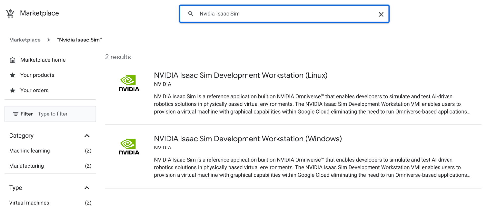
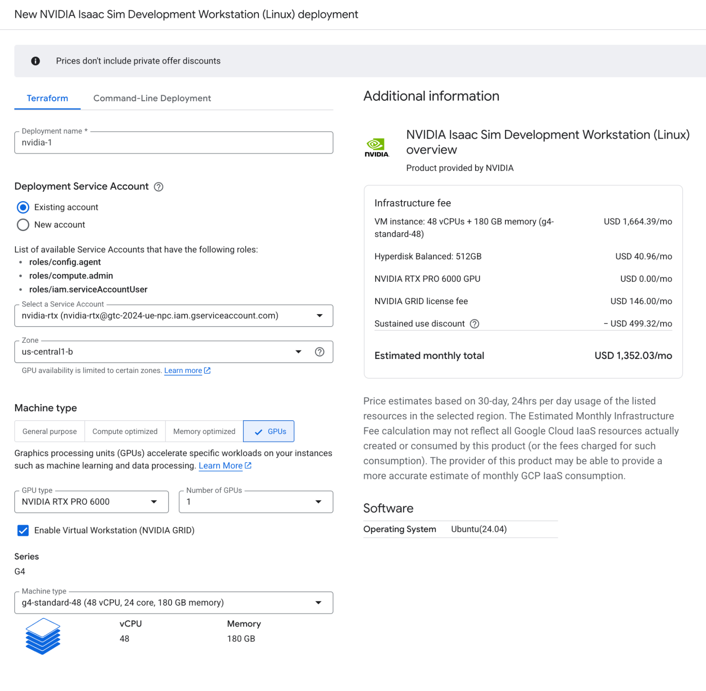
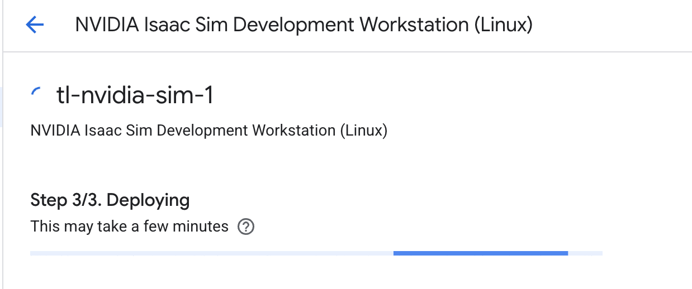

# GCP - NVIDIA Isaac Sim Development Workstation (Linux) Thinlinc installation

This document talks about setting up an NVIDIA Isaac Sim Development Workstation VM with Thinlinc as Remote Visualization tool. 

## What is Thinlinc: 

ThinLinc is a software solution created by Cendio designed to help organizations establish a Linux server-based computing infrastructure. It allows for server-based computing environments on Linux and is recommended by NVIDIA as a remote desktop connection tool for Omniverse workstations. ThinLinc connects on-premise systems to remote visualization VMs via SSH, supporting methods such as SSH with Cloud Identity and OSLogin or local accounts with password authentication.

Download the Thinlinc client \- [https://www.cendio.com/thinlinc/download/](https://www.cendio.com/thinlinc/download/)

## Architecture:

Networking and login: IAP tunnel and SSH key with OSlogin.

Various techniques exist for connecting on-premises environments to Cloud resources. For optimal results, we suggest utilizing an Identity-Aware Proxy (IAP) tunnel configured with OSlogin. This approach offers several distinct benefits:

## what is Identity-Aware Proxy (IAP) and IAP tunnel
[https://cloud.google.com/security/products/iap](https://cloud.google.com/security/products/iap)
[https://docs.cloud.google.com/iap/docs/using-tcp-forwarding](https://docs.cloud.google.com/iap/docs/using-tcp-forwarding)

Identity-Aware Proxy (IAP) is a Google Cloud service that controls access to applications and VMs by verifying user identity and context rather than relying on traditional network firewalls.

The IAP tunnel specifically enables secure TCP forwarding, allowing you to establish SSH or RDP connections to instances that do not have external IP addresses.

By routing traffic through the Google-managed proxy, you eliminate the need for risky "bastion hosts" or exposing port 22 to the open internet.

Ultimately, this architecture ensures that only authorized users with the correct IAM permissions can reach your private resources, significantly reducing your cloud infrastructure's attack surface.

### Benefits
* Enhanced Security \- Connections are fully encrypted between the local workstation and the VM via an IAP tunnel. Access is governed by Cloud Identity, and OSlogin manages the security keys. No external IP being leveraged.  
* Operational Efficiency \- OSlogin simplifies SSH key management. After a single initial setup, keys become accessible across all VMs where OSlogin is enabled.  
* Seamless Cloud Identity Integration \- By leveraging OSlogin, POSIX information remains consistent across the entire VM fleet, removing the need for manual .ssh configurations on individual nodes.
* Thinlinc Licensing: The Thinlinc server software supports 3 users by default immediately after installation. Its free / community license supports up to 10 concurrent users. 
[https://www.cendio.com/thinlinc/buy-pricing/free-usage/](https://www.cendio.com/thinlinc/buy-pricing/free-usage/)

Other details: 

* Cloud identity Account and OSlogin \- This is native Google account associated with login. No other authentication authority needed.    
* VM \- We use the latest Google GPU offering. G4-standard-48 w nvidia-rtx-pro-6000-vws card.  
* ThinLinc \- Remote Visualization Tool common in the HPC industry.


## Setup SSH key with Cloud Identity account:

[https://docs.cloud.google.com/compute/docs/connect/create-ssh-keys](https://docs.cloud.google.com/compute/docs/connect/create-ssh-keys)

1. Creating the SSH key by running the following command:

```
ssh-keygen -t rsa 
```
a key pair shall be created. 

* Id\_rsa  
* Id\_rsa.pub

2. On-prem computer side \- Client workstation / Laptop:  
   We need to make sure the private key is set up in the .ssh (drwx------) directory with file rw------permission. 

   Sample File permission: 

   \-rw-------@ 1 \<user id\>  primarygroup  3454 Jan 15 15:18 id\_rsa

   \-rwx------@ 1 \<user id\>  primarygroup   795 Jan 15 15:18 id\_rsa.pub


   Sample Directory permission: 

   drwx------   10 \<user id\>  primarygroup    320 Jan 15 15:18 .ssh

3. Remote viz VM:  
   No need to have .ssh directory / ssh keys stored in the remote visualization vm. 

4. Adding ssh key to OSlogin: 
```
gcloud compute os-login ssh-keys add --key-file=/home/<user id>/.ssh/id_rsa.pub 
```

## Setup a NVIDIA Isaac Sum Development Workstation (Linux)

1. Netvigate to the GCP MarketPlace and search for “Nvidia Issac Sim”, Select NVIDIA Isaac Sim Development Workstation (Linux)



2. Hit the Launch button to launch the system. 


3. Update the fields accordingly. Including the machine name, required GPU(s), storage and VPC etc. Then hit the Deploy button.







4. The machine is running and ready for SSH. 


## Install Thinlinc on the VM instance

In the SSH window for your VM instance, clone this repository to the home directory and run the setup script provided:

- Git clone this repo to the home directory
- chmod 755 the file "setup_thinlinc.sh"
```
chmod 755 setup_thinlinc.sh
```
- Execute the setup_thinlinc.sh script
```
./setup_thinlinc.sh
```

## Connect to the NVIDIA Isaac Sim workstation VM

1. Setup the IAP tunnel from the On-prem machine: 
Assume the VM name is : nvidia-2-vm
```
gcloud compute start-iap-tunnel <machine name> 22 --local-host-port=localhost:2222 
```

$ gcloud compute start-iap-tunnel nvidia-2-vm 22 \--local-host-port=localhost:2222   
**WARNING:**   
To increase the performance of the tunnel, consider installing NumPy. For instructions,  
please see https://cloud.google.com/iap/docs/using-tcp-forwarding\#increasing\_the\_tcp\_upload\_bandwidth  
Testing if tunnel connection works.  
Listening on port \[2222\].

2. Setup the Thinlinc client and connect:

Start the Thinlinc client on desktop:


Config the ports for IAP and localhost:


Click "Connect" and we see the warning page:


Login: 

