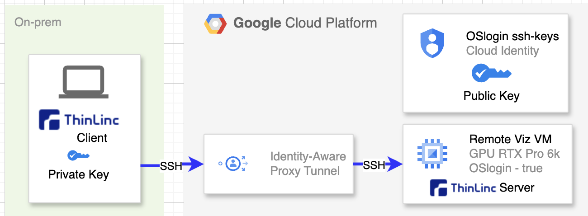
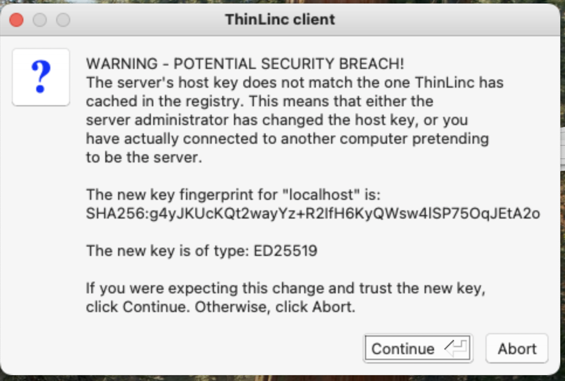

# GCP HPC Remote Visualization VM w Thinlinc

This document talks about setting up an HPC Remote Visualization VM with Thinlinc using GCP Cluster Toolkit.

## What is Thinlinc: 

ThinLinc is a software solution created by Cendio designed to help organizations establish a Linux server-based computing infrastructure. It allows for server-based computing environments on Linux and is recommended by NVIDIA as a remote desktop connection tool for Omniverse workstations. ThinLinc connects on-premise systems to remote visualization VMs via SSH, supporting methods such as SSH with Cloud Identity and OSLogin or local accounts with password authentication.

Download the Thinlinc client \- [https://www.cendio.com/thinlinc/download/](https://www.cendio.com/thinlinc/download/)

## Architecture:

Networking and login: IAP tunnel and SSH key with OSlogin.

Various techniques exist for connecting on-premises environments to Cloud resources. For optimal results, we suggest utilizing an Identity-Aware Proxy (IAP) tunnel configured with OSlogin. This approach offers several distinct benefits:

* Enhanced Security \- Connections are fully encrypted between the local workstation and the VM via an IAP tunnel. Access is governed by Cloud Identity, and OSlogin manages the security keys. No external IP being leveraged.  
* Operational Efficiency \- OSlogin simplifies SSH key management. After a single initial setup, keys become accessible across all VMs where OSlogin is enabled.  
* Seamless Cloud Identity Integration \- By leveraging OSlogin, POSIX information remains consistent across the entire VM fleet, removing the need for manual .ssh configurations on individual nodes.

Other details: 

* Cloud identity Account and OSlogin \- This is native Google account associated with login. No other authentication authority needed.  
* In the Cluster Toolkit blueprint yaml, Nvidia Driver, CUDA, VirtualGL, Gnome and Thinlinc Installation are included in the startup script.   
* VM \- We use the latest Google GPU offering. G4-standard-48 w nvidia-rtx-pro-6000-vws card.  
* VM image \- GCP HPC VM image \- Rocky 8 linux.  
* ThinLinc \- Remote Visualization Tool common in the HPC industry.



## Setup SSH key with Cloud Identity account:

[https://docs.cloud.google.com/compute/docs/connect/create-ssh-keys](https://docs.cloud.google.com/compute/docs/connect/create-ssh-keys)

1. Creating the SSH key by running the following command:

```
ssh-keygen -t rsa 
```
a key pair shall be created. 

* Id\_rsa  
* Id\_rsa.pub

2. On-prem computer side \- Client workstation / Laptop:  
   We need to make sure the private key is set up in the .ssh (drwx------) directory with file rw------permission. 

   Sample File permission: 

   \-rw-------@ 1 \<user id\>  primarygroup  3454 Jan 15 15:18 id\_rsa

   \-rwx------@ 1 \<user id\>  primarygroup   795 Jan 15 15:18 id\_rsa.pub

   

   Sample Directory permission: 

   drwx------   10 \<user id\>  primarygroup    320 Jan 15 15:18 .ssh

3. Remote viz VM:  
   No need to have .ssh directory / ssh keys stored in the remote visualization vm. 

4. Adding ssh key to OSlogin: 
```
gcloud compute os-login ssh-keys add --key-file=/home/thomashk_thomashk_altostrat_com/.ssh/id_rsa.pub 
```

## Deploy the cluster with Cluster Toolkit:

We are going to use Cloud Cluster Toolkit for deploying the solution. All GCP foundation work shall be done prior to use this doc:

- Installation of Terraform , Go, Packer  
- Enable GCP APIs  
- Firewall for external IP addresses needs to be in place.   
- Install of Cloud Toolkit for deployment

Using Google Cloud Cluster Toolkit:   
[https://github.com/GoogleCloudPlatform/cluster-toolkit](https://github.com/GoogleCloudPlatform/cluster-toolkit)

Cluster Toolkit blueprint yaml is hpc-remote-viz-thinlinc.yaml
   
Create the Rocky 8 VM by using Cluster Toolkit: 

```
./gcluster deploy -w hpc-remote-viz-thinlinc.yaml 
```

It takes about 10 \- 15 mins for the startup scripts to finish:  
\*\* WARNING \*\*: The Cluster Toolkit startup scripts are currently running.

We need to wait till it is all completed before connecting to the VM using Thinlinc.

Destroy the VM with gcluster command: 
```
gcluster destroy rocky-thinlinc 
```

## Connect to the Remote Visualization VM

1. Setup the IAP tunnel from the On-prem machine: 
Assume the VM name is : rocky8-thinlinc-g4-gpu-vm-0
```
gcloud compute start-iap-tunnel rocky8-thinlinc-g4-gpu-vm-0 22 --local-host-port=localhost:2222 
```

thomashk-macbookpro2:\~ thomashk$ gcloud compute start-iap-tunnel rocky8-thinlinc-chrome-remote-desktop-0 22 \--local-host-port=localhost:2222  
No zone specified. Using zone \[us-central1-b\] for instance: \[rocky8-thinlinc-chrome-remote-desktop-0\].  
**WARNING:**   
To increase the performance of the tunnel, consider installing NumPy. For instructions,  
please see https://cloud.google.com/iap/docs/using-tcp-forwarding\#increasing\_the\_tcp\_upload\_bandwidth  
Testing if tunnel connection works.  
Listening on port \[2222\].

2. Setup the Thinlinc client and connect:





# Other useful information / commands:   
Disabling the screensaver:

Screen savers must be deactivated because Cloud Identity accounts do not utilize passwords. Instead, ensure that any lock screen functionality is actively locked.

Command to disable the screensaver:

```
gsettings set org.gnome.desktop.screensaver lock-enabled false 
```

Unlock all the screens:
```
sudo loginctl unlock-sessions
```
