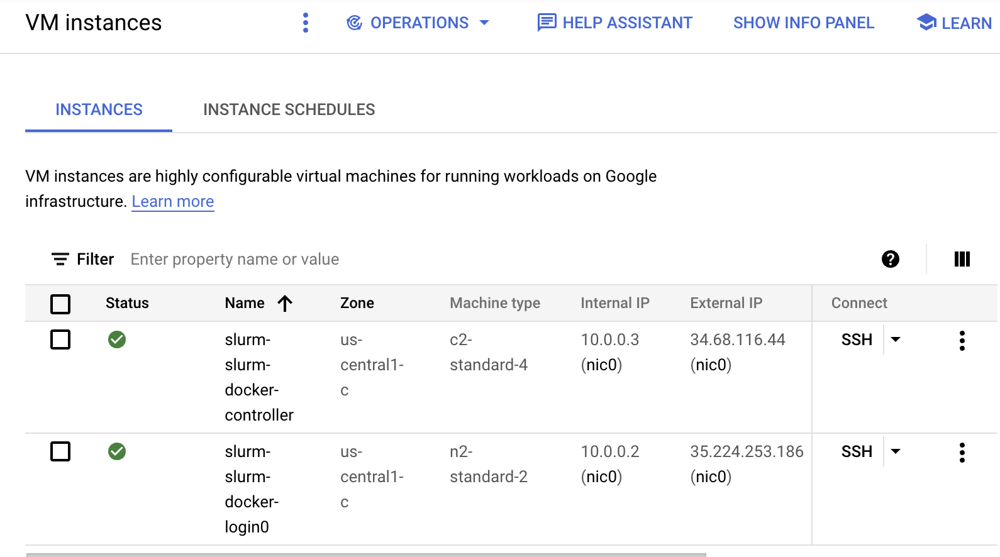

# Example: HPC Toolkit Support Slurm and Docker 

## Overview

This example creates a Slurm Cluster that supports the execution Docker containers.

# Run HPC Toolkit

## Create a project

Create a GCP Project [as described here](https://cloud.google.com/resource-manager/docs/creating-managing-projects).


Follow [the instructions here](https://github.com/GoogleCloudPlatform/hpc-toolkit#quickstart) to install the HPC Toolkit.

In the Hpc Toolkit folder run an install.

```
make install
```

## Import the repo

Import this repo to your Google Cloud Shell

[](https://shell.cloud.google.com/cloudshell/editor?cloudshell_git_repo=https://github.com/GoogleCloudPlatform/scientific-computing-examples.git)


## Enable Google Cloud APIs

To execure the required go to the [console API Library](https://console.cloud.google.com/apis/library).
Enable the Compute Engine and Cloud Firestore APIs.

## Build Terraform using the HPC Toolkit

* Edit the `slurm-docker.yaml` file.
  * Change `<your project>` to be the `my-project-id` of the project you created in the previous step
  * Change `<oslogin_user_id> to your OS Login id, which should follow: `USERNAME_DOMAIN_SUFFIX`, with all punctuation replaced by underscore, `_`.

When `ghpc` is in your path, you can run in this repo.

```
cd slurm-cookbook/docker
ghpc create slurm-docker.yaml
```
The output of this job, when successful will show some terraform commands. Execute these commands to build out the Slurm cluster.

# Run a job in the cluster

When the cluster build has completed there will be [two VMs visible in the Cloud Console](https://console.cloud.google.com/compute/instances): the controller node and the login node. You can login to the "login" node by clicking on the "SSH" link provide in the console VM listing.



Once there you can create a Slurm job file by running:

```
tee hello.job << JOB
#!/bin/bash
#SBATCH --job-name=dkr_ex
#SBATCH --ntasks-per-node=2
#SBATCH --cpus-per-task=1
#SBATCH --mem-per-cpu=2
#SBATCH --partition=compute
#SBATCH --array=1-10
#SBATCH --output=out_%3A_%3a.txt
#SBATCH --error=err_%3A_%3a.txt

docker run hello-world
JOB
```

Then run the batch file:
```
sbatch hello.job
```
You can view the queue using `squeue`. When the job is completed, there will be `*.out` files with results from the `hello-world` container. If there are only `*.err` files, there is some debugging to do.